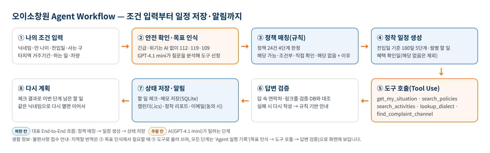
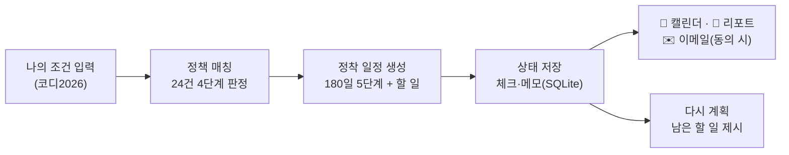
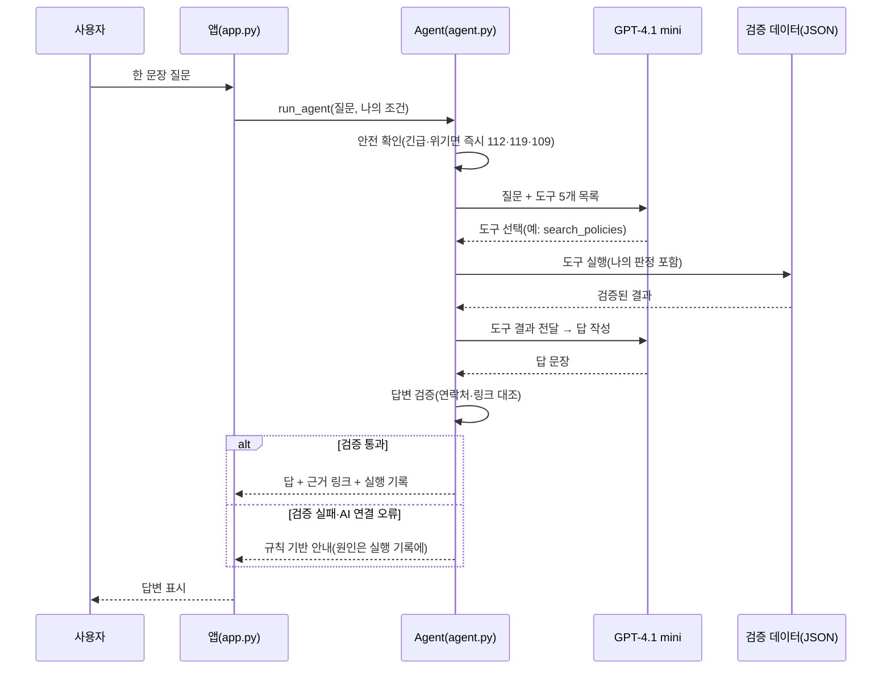
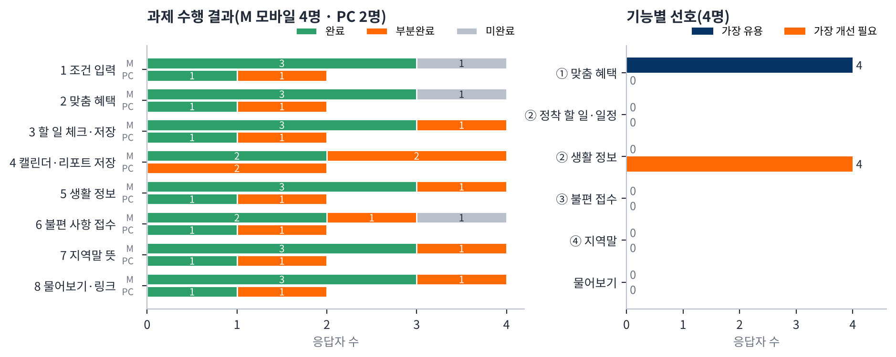

# 오이소창원 — AI 기반 창원 정착 지원 Agent 🏙️

> 창원에 새로 전입한 청년이 첫 180일 동안 놓치기 쉬운 혜택과 할 일을,
> 나의 조건으로 판정하고 일정으로 만들어 함께 챙겨 주는 코디네이터 Agent
> — 슬로건: **창원에서 너의 내일을 응원해!**


**🔗 배포 앱:** https://oisochangwon-4fuybothxlr78qnnaappqv.streamlit.app/ (오른쪽 QR로 휴대폰에서 바로 접속)
**💻 GitHub:** https://github.com/jojunsu98/oiso_changwon
**📄 개발완료보고서:** [`deliverables/final_report/오이소창원_개발완료보고서_20261004.md`](deliverables/final_report/%EC%98%A4%EC%9D%B4%EC%86%8C%EC%B0%BD%EC%9B%90_%EA%B0%9C%EB%B0%9C%EC%99%84%EB%A3%8C%EB%B3%B4%EA%B3%A0%EC%84%9C_20261004.md)
**📋 기획안(최종본):** [`docs/planning/오이소창원_기획안_최종본_20261004.md`](docs/planning/%EC%98%A4%EC%9D%B4%EC%86%8C%EC%B0%BD%EC%9B%90_%EA%B8%B0%ED%9A%8D%EC%95%88_%EC%B5%9C%EC%A2%85%EB%B3%B8_20261004.md)
**🛠 Streamlit 관리(개발자, 로그인 필요):** https://share.streamlit.io → oisochangwon → Settings → Secrets
**✉️ 앱 문의:** whwnstn9294@gmail.com

제4회 경남 AI·SW 경진대회 일반부 · 지정주제 01(사회문제 해결형 AI Agent) · 팀 오이소창원(조준수 팀장 · 이혜경 · 이미영)


---

## 목차

1. [프로젝트 소개](#1-프로젝트-소개)
2. [해결하려는 문제 (3가지)](#2-해결하려는-문제-3가지)
3. [프로젝트 개요 및 산출물 구성](#3-프로젝트-개요-및-산출물-구성)
4. [폴더 구조](#4-폴더-구조)
5. [기술 스택](#5-기술-스택)
6. [데이터 설명 및 출처](#6-데이터-설명-및-출처)
7. [핵심 기능과 기존 서비스와 다른 점](#7-핵심-기능과-기존-서비스와-다른-점)
8. [전체 작업 순서 (STEP 1-16)](#8-전체-작업-순서-step-1-16)
9. [작업 흐름도 (Agent Workflow)](#9-작업-흐름도-agent-workflow)
10. [AI(GPT-4.1 mini) Agent 연동 구조](#10-aigpt-41-mini-agent-연동-구조)
11. [화면 구성](#11-화면-구성)
12. [저장·알림 기능](#12-저장알림-기능)
13. [로컬 실행 방법](#13-로컬-실행-방법)
14. [배포 방법 및 환경 변수](#14-배포-방법-및-환경-변수)
15. [개발 중 발생한 오류와 해결](#15-개발-중-발생한-오류와-해결)
16. [AI 도구 사용 로그 요약](#16-ai-도구-사용-로그-요약)
17. [테스트 결과와 대회 요구사항 대비 결과](#17-테스트-결과와-대회-요구사항-대비-결과)
18. [결론 및 한계점](#18-결론-및-한계점)
19. [보안 유의사항](#19-보안-유의사항)
20. [데이터 출처 및 라이선스 유의사항](#20-데이터-출처-및-라이선스-유의사항)
21. [기타 (다음 작업)](#21-기타-다음-작업)

---

## 1. 프로젝트 소개

경남은 청년 순유출이 계속되는 지역이고, 창원은 그중에서도 순유출이 많은 도시입니다. 막 이사 온 청년은 전입신고·교통·주거 혜택처럼 **기한이 있는 일**을 언제 해야 하는지 모르고 지나치기 쉽고, 정보는 여러 누리집에 흩어져 있습니다.

오이소창원은 **나의 조건(나이·전입일·하는 일·차량 등)**만 입력하면 창원·청년 정책 24건을 실제로 판정해 4단계로 나누고, 전입일 기준 180일 정착 일정과 할 일로 만들어 줍니다. 궁금한 것은 **오이소창원(코디네이터 Agent)**에게 한 문장으로 물으면, AI(GPT-4.1 mini)가 질문을 분석해 팀이 검증한 자료 도구를 골라 쓰고, 답 속 연락처·링크를 검증한 뒤 안내합니다.

- **대상:** 창원에 새로 전입한(또는 전입 예정인) 청년, 시연 페르소나 ‘코디2026’(28세·2026-09-20 전입·직장인·차량 없음)
- **핵심 가치:** 흩어진 정보를 “내 조건 → 판정 → 일정 → 저장”으로 한 번에, 실명·연락처 없이
- **4대 기능 + Agent:** ① 맞춤 혜택 알림 / ② 생활 정보 안내·일정 편성 / ③ 불편사항 접수 안내 / ④ 지역말 번역 + 오이소창원에게 물어보기
- **저장·알림:** 📅 캘린더(.ics, 하루 전 오전 9시 알림) · 📄 정착 리포트 · ✉️ 이메일 알림(선택, 동의 2개)

---

## 2. 해결하려는 문제 (3가지)

1. 전입 청년이 **내 조건으로 받을 수 있는 혜택**을 스스로 찾고 판단하기 어렵다 → 정책 24건 4단계 판정 + 이유 + 지금 할 일
2. 혜택·할 일에 **기한**이 있는데 언제 무엇을 해야 하는지 놓친다 → 전입일 기준 180일 일정 + 캘린더 알림
3. 낯선 도시에서 **생활 정보·불편 접수 창구·지역말**을 물어볼 곳이 없다 → 검증 자료만 쓰는 Agent가 한 문장 질문에 답하고 근거 링크 제시

---

## 3. 프로젝트 개요 및 산출물 구성

| 항목 | 내용 |
| :---: | --- |
| 과제명 | 오이소창원 — AI 기반 창원 정착 지원 Agent |
| 지정주제 | 01 사회문제 해결형 AI Agent (일반부) |
| 개발 유형 | B형(App + LLM API) + 답변 검증 단계 |
| 팀 역할 | A 조준수(팀장) 전체 자료 최종 점검·수정 · B 이혜경 일정 알림 기능 개발·기획·문서 · C 이미영 기능별 화면 점검·개선 리포트 |
| AI | 앱: OpenAI GPT-4.1 mini(도구 호출) / 개발: 주로 GPT와 Claude |
| 기간 | 2026-09-29 ~ 10-04(개발·검증), 제출 10/5(팀 목표) · 10/6 12:00(운영규정 기본 마감) |

**산출물 구성**

| 산출물 | 형식 | 위치 |
| --- | :---: | --- |
| 웹 앱 | Streamlit, Streamlit Community Cloud 배포 | `app.py`, `src/`, `data/` |
| 기획안 | 초안 PDF · 최종본 md·pdf·docx | `docs/planning/` |
| 개발완료보고서 | md·pdf·docx (A4 5쪽) | `deliverables/final_report/` |
| AI Agent 기술설명서 | 1쪽 (10/5 작성) | `deliverables/technical_description/` |
| 출처·AI 활용 신고서 | md·pdf·docx | `deliverables/submission/` |
| 시연영상·스크립트 | 3분 이내 · 스크립트 md·pdf·docx | `deliverables/presentation/video/` |
| 발표자료 | 10장 이내 (10/5 작성) | `deliverables/presentation/ppt/` |
| 테스트 3종 | 코드·체크리스트·보고서·설문 결과 | `tests/` |
| 증빙 캡처 | PNG·JPG 120장 | `screenshots/` |

---

## 4. 폴더 구조

폴더 이름은 영어로 두었습니다(앱 파일 위치를 바꾸면 배포 주소가 바뀔 수 있어서). 괄호 안이 한글 뜻입니다.

```
oiso_changwon/
├── README.md                    ← 지금 보고 있는 파일
├── app.py (화면·배포 시작 파일)  Streamlit 화면 — 위치 변경 금지
├── requirements.txt (배포 설정)  streamlit · python-dateutil · openai · anthropic
├── .streamlit/ (화면 테마)       남색 #063465 · 주황 #FE6A01
├── assets/ (이미지)              로고
│
├── src/ (처리 로직, 12개 모듈)
│   ├── agent.py                 Agent: 안전 확인 → 도구 선택·호출 → 답변 검증 → 규칙 대체, 실행 기록
│   ├── policy_matcher.py        정책 24건 4단계 판정 · 일정 이벤트
│   ├── policy_engine.py         기업노동자 전입지원금(P01) 판정
│   ├── settlement_engine.py     전입일 기준 정착 일정
│   ├── mission_manager.py       1~6개월 할 일(하는 일별 문구)
│   ├── progress_manager.py      진행률 · 현재 단계
│   ├── state_manager.py         체크·메모 저장(SQLite)
│   ├── schedule_export.py       캘린더(.ics) · 정착 리포트
│   ├── email_alerts.py          동의 기반 이메일 알림(신청·해지·발송)
│   ├── activity_manager.py      생활 정보 60곳 필터
│   ├── naver_map_links.py       네이버 지도 검색 링크
│   └── policy_resource_manager.py  할 일 공식 링크 검증
│
├── data/ (팀 검증 데이터, JSON)  정책 24 · 할 일 26 · 할 일 링크 18 · 생활 정보 60 · 지역말 30+2,223 · 접수 창구 6
│
├── tests/ (테스트 3종)
│   ├── ai_test/ (AI 자동 테스트)        unittest 127개
│   ├── team_self_test/ (팀 자체 테스트)  Test Case · 체크리스트 · 자체평가 테스트보고서(이혜경·이미영) · 결과 반영표
│   └── user_test/ (실사용자 테스트)      오이소창원_사용자테스트_서류양식(설문 Apps Script·평가지) · results_20261004(4명 결과·그래프)
│
├── docs/ (문서)
│   ├── planning/ (기획)          기획안 초안(10/1) · 최종본(10/4) · 그림
│   ├── images/ (그림)            Workflow 다이어그램
│   ├── work_process/ (작업 과정)  캡처 설명
│   └── ux_ui/ (UX/UI)            개선 작업 프롬프트
│
├── deliverables/ (최종 제출물)
│   ├── final_report/ (개발완료보고서)
│   ├── technical_description/ (AI Agent 기술설명서)
│   ├── submission/ (출처·AI 활용 신고서)
│   └── presentation/ (발표) ── ppt/ · video/
│
├── screenshots/ (화면 캡처)
│   ├── during_development/ (기능 구현 과정)  ai_test 26장 · work_process 31장
│   └── after_development/ (기능 구현 이후)   team_self_test 37장 · ui_update 16장 · implementation_complete 15장 · 최종구현사진 18장(10/4 최종) · user_test
│
└── handoff/ (인수인계, 제출 전 삭제)  작업지시·인계서 · 문서 수정 메모 · tools(문서 변환)
```

---

## 용어 설명 (처음 보는 분을 위한 참고)

| 용어 | 쉬운 설명 |
| :---: | --- |
| Agent | 목표를 이해하고, 필요한 도구를 골라 쓰고, 결과를 확인해 다음 행동을 정하는 AI 프로그램 |
| 도구 호출(Tool Use) | AI가 직접 지어내지 않고, 정해진 함수(정책 검색·장소 검색 등)를 불러 결과를 받아 쓰는 방식 |
| 답변 검증 | AI 답 속 전화번호·링크가 도구 결과(검증 DB)에 실제로 있는지 대조하는 단계 |
| 4단계 판정 | 해당 가능 · 조건부 해당 가능 · 직접 확인 필요 · 해당 없음 |
| 전입일 | 새 주소로 전입신고를 한 날. 정착 일정·혜택 신청 시기를 계산하는 기준 |
| .ics | 휴대폰·PC 캘린더에 일정을 넣는 표준 파일 형식 |
| Streamlit | 파이썬만으로 웹 화면을 만드는 도구. 화면과 로직을 같은 언어로 작성 |
| Secrets | API 키·메일 비밀번호를 코드 밖(배포 설정)에 숨겨 두는 저장 공간 |
| SQLite | 파일 하나로 동작하는 작은 데이터베이스. 할 일 체크·메모·이메일 신청 저장 |
| SMTP | 메일을 보내는 표준 방식(Gmail은 앱 비밀번호 필요) |

---

## 5. 기술 스택

| 구분 | 내용 |
| :---: | --- |
| 언어 | Python 3 |
| 화면·배포 | Streamlit 1.64 · Streamlit Community Cloud |
| AI | OpenAI GPT-4.1 mini(Function calling), 대체 연결 코드(Anthropic SDK) |
| 데이터 | JSON(팀 검증 데이터), SQLite(체크·메모·이메일 신청) |
| 날짜 계산 | python-dateutil |
| 내보내기 | iCalendar(.ics) 직접 생성, HTML 정착 리포트 |
| 메일 | Python smtplib(Gmail SMTP 587/465) |
| 테스트 | unittest · Streamlit AppTest · Playwright(화면 캡처) |
| 설문 | Google Forms · Sheets · Apps Script |
| 버전관리 | Git / GitHub |

---

## 6. 데이터 설명 및 출처

**목적:** 혜택·연락처·지역말은 틀리면 바로 피해가 생기므로, 팀이 공식 출처로 확인한 값만 쓰고 확인일·링크를 함께 보여 줍니다. AI는 이 데이터 밖의 값을 만들지 않습니다.

| 데이터 | 규모 | 출처 | 파일 |
| :---: | :---: | --- | --- |
| 정책 | 24건 | 창원시 인구·청년정책 누리집, 창원청년정보플랫폼, 고용노동부·금융위원회·정책브리핑 등 공식 공고 | `data/policies_mvp.json` |
| 정착 할 일 | 26개 · 링크 18 | 창원시·경상남도·창원시설공단·K-패스·1365·경남바로서비스·모다드림 공식 안내 | `data/missions.json`, `data/mission_resources.json` |
| 생활 정보 | 60곳(차량 권장 8) | 대한민국 구석구석, 창원시·창원시설공단·경상남도, 운영 기관 안내 등 대조 | `data/activities_mvp.json` |
| 지역말 | 핵심 30 + 확장 2,223 | 국립국어원 우리말샘(CC BY-SA 2.0 KR)·온라인가나다, 경남방언사전, 디지털창원문화대전 | `data/dialects_core30.json`, `data/dialects_ext.json` |
| 불편 접수 창구 | 6단계 | 창원시 누리집, 국민신문고, 창원시청 통화 확인(2026-09-29), 109, 경남 청년마음단디센터 | `data/complaint_channels.json` |

**데이터 원칙**
- 정책마다 **최종 확인일·공식 링크** 표시, 대상 여부는 단정하지 않음(최종 판단은 담당 기관)
- 지역말은 **공식 출처 항목만** 사용, 제보 기반 자료 제외, 사전 밖 말은 뜻을 짐작하지 않음
- 생활 정보는 특정 업체 홍보가 아니며, 대중교통으로 가기 어려운 8곳은 ‘차로 가면 좋은 곳’으로 분리

출처별 공식 링크 전체는 [`출처·AI 활용 신고서`](deliverables/submission/%EC%98%A4%EC%9D%B4%EC%86%8C%EC%B0%BD%EC%9B%90_%EC%B6%9C%EC%B2%98_AI%ED%99%9C%EC%9A%A9_%EC%8B%A0%EA%B3%A0%EC%84%9C_20261004.md) 4장에 정리했습니다.

---

## 7. 핵심 기능과 기존 서비스와 다른 점

| 기능 | 내용 |
| :---: | --- |
| ① 창원 청년 맞춤형 혜택 알림 | 정책 24건을 4단계로 판정, 판단 이유·지금 할 일·신청 가능 예정일·공식 링크·확인일. 차량이 없으면 K-패스를 먼저, 해당 없음은 신청 안내 없이 이유만 |
| ② 창원 생활 정보 안내 및 일정 편성 | 전입일 기준 5단계 일정(전입한 날·첫 주·정착 1–2개월·3-5개월·6개월 이후) + 1–6개월 할 일 26개(체크·메모 저장), 생활 정보 60곳(지역·분야 필터, 이동 안내, 네이버 지도) |
| ③ 불편사항 행정 접수안내 | 한 문장 상황 → 6단계(긴급·높음·보통·제안·마음 건강·위기) 판단 → 접수 창구. 긴급·위기는 AI 없이 즉시 112·119·109 |
| ④ 창원 지역말 번역 | 2,253개 사전에서 ‘문헌 기준 뜻’, 사전 밖 말은 “별도 확인 필요” + 우리말샘 링크 |
| 오이소창원에게 물어보기 | 네 기능을 넘나드는 한 문장 질문 → 도구 선택·호출 → 답변 검증 → 답 + 근거 링크 + Agent 실행 기록 |

**기존 서비스와 다른 점:** 창원청년정보플랫폼이 정책 게시·신청 중심이라면, 오이소창원은 **나의 조건으로 실제 판정해 이유와 지금 할 일**을 설명하고, 그 결과를 **📅 내 캘린더·📄 정착 리포트**로 남깁니다. 신청은 플랫폼·공식 사이트로 연결합니다(보완 관계).

---

## 8. 전체 작업 순서 (STEP 1-16)

| STEP | 작업 내용 | 날짜 | 증빙 |
| :---: | --- | :---: | :---: |
| 1 | 온라인 OT, 주제·문제·사용자 확정, 기획안 초안 | 9/29~10/1 | `docs/planning` |
| 2 | 정책·할 일·생활 정보·지역말·접수 창구 데이터 조사·검증(JSON) | 9/29~10/2 | `data/` |
| 3 | 기업노동자 전입지원금 판정 · 전입일 기준 정착 일정 | 10/1 | — |
| 4 | 1~6개월 할 일 저장(SQLite) · 생활 정보 둘러보기 | 10/1 | — |
| 5 | 정책 24건 4단계 판정 · 기능별 화면 분리 | 10/2 | work_process 01-12 |
| 6 | 코디네이터 Agent(GPT-4.1 mini 도구 호출·답변 검증·실행 기록) | 10/2 | work_process 17-26 |
| 7 | 대표 Test Case 6건 PC·모바일 자동 실행 | 10/2 | ai_test 26장 |
| 8 | Streamlit Cloud 배포 · Secrets 설정 | 10/2 | work_process 23, 27 |
| 9 | 📅 캘린더 · 📄 정착 리포트 · ✉️ 동의 기반 이메일 알림 | 10/3 | after_development 08-11 |
| 10 | ③ 불편사항 · ④ 지역말 화면 개선 | 10/3 | after_development 31-32 |
| 11 | 팀 자체 테스트 — B 이혜경(웹·모바일, 30회 이상) → 기록된 지적 반영 | 10/2–10/4 | after_development 01-33 |
| 12 | 팀 자체 테스트 — C 이미영(PC·휴대폰 2회) 9건 반영, A 조준수 전체 검수 | 10/3 | after_development 34-37 |
| 13 | 실사용자 4명 테스트·설문 → 의견 반영 | 10/3–10/4 | `tests/user_test/results_20261004` |
| 14 | 첫 화면·전체 UI 다듬기 → 첫 화면·세부 화면 새 디자인(남색 배경·작은 로고·흰 카드) | 10/3~10/4 | ui_update 16장 |
| 15 | 기획안·개발완료보고서·신고서·영상 스크립트·README 작성 | 10/4 | `docs/` · `deliverables/` |
| 16 | 기술설명서·시연영상·발표자료, 최종 제출 | 10/5 | — |

---

## 9. 작업 흐름도 (Agent Workflow)

**목적:** 오이소창원은 “규칙 판정(정책·일정)”과 “AI 판단(질문 분석·도구 선택)”이 함께 일합니다. 어느 단계를 규칙이 하고 어느 단계를 AI가 하는지, 그리고 결과가 어떻게 저장·알림까지 이어지는지 한눈에 보이도록 정리했습니다.



| 단계 | 하는 일 | 누가 |
| :---: | --- | :---: |
| ① 나의 조건 입력 | 닉네임·만 나이·전입일·사는 구·타지역 거주기간·하는 일·차량(실명·연락처 없음) | 사용자 |
| ② 안전 확인·목표 인식 | 긴급(112·119)·위기(109)는 AI 없이 바로 안내, 그 밖의 질문은 분석해 필요한 도구 선정 | 규칙 + GPT-4.1 mini |
| ③ 정책 매칭 | 정책 24건을 4단계로 판정, 이유 표시 | 규칙 |
| ④ 정착 일정 생성 | 전입일 기준 180일 5단계·월별 할 일·혜택 확인일(해당 없음 제외) | 규칙 |
| ⑤ 도구 호출 | get_my_situation · search_policies · search_activities · lookup_dialect · find_complaint_channel | GPT-4.1 mini |
| ⑥ 답변 검증 | 답 속 전화번호·링크를 검증 DB와 대조, 없으면 1회 다시 작성 → 실패 시 규칙 기반 안내 | 규칙 |
| ⑦ 상태 저장·알림 | 할 일 체크·메모(SQLite), 📅 캘린더·📄 정착 리포트, ✉️ 이메일(동의 시) | 사용자 선택 |
| ⑧ 다시 계획 | 체크 결과로 이번 단계 남은 할 일 제시, 같은 닉네임으로 다시 열면 이어서 | 규칙 |

### 9-1. 대표 End-to-End 흐름



### 9-2. 오이소창원에게 물어보기 요청 시퀀스



---

## 10. AI(GPT-4.1 mini) Agent 연동 구조

AI는 `src/agent.py`에서 호출합니다. 키는 Streamlit Secrets에서만 읽습니다.

```python
client = openai.OpenAI(api_key=OPENAI_API_KEY)          # Secrets
response = client.chat.completions.create(model="gpt-4.1-mini", messages=messages, tools=TOOLS)
```

**도구(Tool) 5개**

| 도구 | 하는 일 |
| :---: | --- |
| get_my_situation | 나의 조건·전입 경과·혜택 판정(해당 가능/조건부/해당 없음 목록)·이번 단계 할 일 |
| search_policies | 정책 검색 + 나의 판정(해당 없음은 받을 수 있는 혜택으로 소개하지 않음) |
| search_activities | 생활 정보 60곳 검색(차량 없으면 대중교통 기준, 외곽은 따로) |
| lookup_dialect | 지역말 사전 조회(사전 밖이면 found=false) |
| find_complaint_channel | 불편 단계별 접수 창구 |

**오류 처리**

| 상황 | 처리 |
| --- | --- |
| 긴급·위기 문장 | AI를 거치지 않고 112·119·109 즉시 안내 |
| 키 오류·권한·한도·연결 실패 | 규칙 기반 안내로 자동 전환, 원인(키 값 가림)은 실행 기록에 |
| 도구 호출 방식 미지원 | AI가 JSON으로 도구를 고르는 방식으로 한 번 더 |
| 답 속 값이 검증 DB에 없음 | 1회 다시 작성 → 그래도 없으면 규칙 기반 안내 |
| 도구 반복 | 최대 4회(MAX_TOOL_ROUNDS) |

### 설계 노트

- **혜택 판정은 규칙, 질문 이해는 AI:** 지원 자격처럼 틀리면 피해가 큰 판정은 규칙으로 고정하고, AI는 질문 분석·도구 선택·쉬운 문장 작성에 씁니다. 그래서 AI가 바뀌어도 판정 결과는 같습니다.
- **AI 답과 화면 판정 일치:** 10/3 팀 자체 테스트에서 직장인에게 미취업자 대상 사업이 소개된 문제를 발견해, 도구가 화면과 같은 개인 판정(‘나의 판정’)을 함께 돌려주도록 고쳤습니다.
- **실명 없이 이어 쓰기:** 회원가입 대신 닉네임으로 체크·메모를 저장하고, 오래 보관은 캘린더·리포트 파일로 안내합니다.
- **무료 서버 대기(콜드스타트):** 한동안 접속이 없으면 첫 화면이 뜨는 데 1분 정도 걸릴 수 있습니다.

---

## 11. 화면 구성

10/4 최종 구현 화면입니다(배포 앱, GPT-4.1 mini 연결). 전체 18장: [`screenshots/after_development/최종구현사진/`](screenshots/after_development/%EC%B5%9C%EC%A2%85%EA%B5%AC%ED%98%84%EC%82%AC%EC%A7%84/)

**PC**

| 첫 화면(처음 방문) | ① 맞춤 혜택 4단계 판정 |
|:---:|:---:|
|  |  |

| ② 정착 일정 | ② 생활 정보 |
|:---:|:---:|
|  |  |

| ③ 불편사항(GPT-4.1 mini) | ④ 지역말(GPT-4.1 mini) |
|:---:|:---:|
|  |  |

| 오이소창원에게 물어보기(검증 통과·실행 기록) |
|:---:|
|  |

**휴대폰**

| 첫 화면 | 나의 조건 입력 | ① 맞춤 혜택 | ② 정착 일정 |
|:---:|:---:|:---:|:---:|
|  |  |  |  |

| ② 생활 정보 | ③ 불편사항 결과 | ④ 지역말 | ④ 지역말 결과 |
|:---:|:---:|:---:|:---:|
|  |  |  |  |

---:|
|  |

---

## 12. 저장·알림 기능

| 기능 | 구현 내용 |
| :---: | --- |
| 📅 캘린더에 저장 | 정착 일정 5 · 월별 할 일 6 · 혜택 확인일(해당 가능·조건부)을 .ics로, 하루 전 오전 9시 알림 |
| 📄 정착 리포트 저장 | 나의 조건 · 할 일 진행 · 다가오는 일정 · 맞는 혜택 4부분 HTML(인쇄하면 PDF), 닉네임·실명 없음 |
| ✉️ 이메일 알림 신청(선택) | 개인정보 수집·이용 + 수신 2개 동의 후 신청 즉시 전체 일정 메일(.ics 첨부), 일정 하루 전 알림, 해지 즉시 삭제 |

| 저장 버튼 3개 | 정착 리포트 |
|:---:|:---:|
|  |  |

> 이메일 발송 현황(10/4): 신청·동의·해지 절차와 코드는 완성. 배포 서버에서 Gmail이 로그인 단계에서 연결을 끊어(587·465 모두) **보내는 계정 보안 확인·앱 비밀번호 재발급을 기다리는 중**입니다. 실패하면 이메일은 저장하지 않고 캘린더 알림을 안내합니다.

---

## 13. 로컬 실행 방법

```powershell
python -m venv .venv
.\.venv\Scripts\Activate.ps1          # Windows 기준
python -m pip install -r requirements.txt
python -m streamlit run app.py
```

AI 키가 없어도 실행됩니다(‘기본 안내(키워드 규칙)’로 동작). 테스트:

```powershell
python -m unittest discover -s tests/ai_test -v
```

---

## 14. 배포 방법 및 환경 변수

1. GitHub 저장소를 Streamlit Community Cloud와 연동(New app → `app.py`)
2. **app.py · requirements.txt · .streamlit · src · data 위치를 바꾸지 않기**(배포 주소 유지)
3. Settings → **Secrets**에 아래 값 입력 후 Reboot

| 변수명 | 설명 | 필수 |
| :---: | --- | :---: |
| `OPENAI_API_KEY` | GPT-4.1 mini 호출 키 | 권장(없으면 규칙 기반 안내) |
| `SMTP_USER` | 보내는 Gmail 주소 | 이메일 알림 시 |
| `SMTP_PASSWORD` | Gmail **앱 비밀번호** 16자리(2단계 인증 후 발급) | 이메일 알림 시 |
| `SMTP_HOST` · `SMTP_PORT` · `SMTP_FROM` | Gmail이 아닐 때·보내는 사람 표시 변경 시 | 선택 |

Secrets를 고칠 때 `OPENAI_API_KEY` 줄을 지우지 않도록 주의합니다.

---

## 15. 개발 중 발생한 오류와 해결

| 오류 | 원인 | 해결 | 증빙 |
| --- | --- | --- | :---: |
| AI 연결 오류(AuthenticationError) | API 키 불일치 | Secrets 키 교체 후 앱 재시작, 실패 시 규칙 기반 안내 자동 전환 | work_process 20-25 |
| 야경 추천에 외곽 장소 포함 | 대중교통 조건 미반영 | 차량 없음이면 버스 기준, 외곽 8곳 ‘차로 가면 좋은 곳’ 분리 | work_process 19, 26 |
| 지역말 사전 밖 단어에 시청 전화 안내 | 범위 밖 안내 규칙 | 지역말은 콜센터 안내 없이 우리말샘 링크 | work_process 22 |
| 진해 공식 안내 링크 2번 노출 | 답 아래 링크 버튼 중복 | 링크는 답 문장 속에만 | after_development 25-30 |
| 직장인에게 미취업자 사업 소개(J-2) | AI 도구에 개인 판정 없음 | ‘나의 판정’ 추가·해당 없음 소개 금지 | 자동 테스트 |
| 해당 없음 카드에 신청 예정일(D-6) | 제외 판정에도 일정 생성 | 해당 없음은 일정·캘린더 제외 | 자동 테스트 |
| 생활 정보 선택칸·상세 불일치(G-2) | 필터 변경 후 이전 선택 | 첫 장소로 명시 지정 | 자동 테스트 |
| ‘← 처음으로’가 안 눌림 | 투명한 상단 띠가 클릭 가로챔 | 띠 클릭 통과 처리 | 브라우저 확인 |
| 이메일 발송 실패 | Gmail 로그인 단계 연결 끊김 | 587↔465 재시도·단계별 원인 표시, 계정 보안 확인 대기 | after_development 33 |
| 카카오톡 미리보기 옛 화면 | 카카오 캐시 | 카카오 캐시 초기화·메타 재조회 | work_process 28-31 |

| 오류 발생 | 원인 추적(실행 기록) | 해결 후 |
|:---:|:---:|:---:|
|  |  |  |

---

## 16. AI 도구 사용 로그 요약

| 사람 | 도구 | 사용 작업 | 검증 방법 |
| :---: | :---: | --- | --- |
| B 이혜경 | Claude(코딩 에이전트) | 코드 작성·수정·디버깅, 자동 테스트, 화면 캡처, 문서 초안 | 자동 테스트 127개 실행, 배포 앱 직접 조작, 팀 자체 테스트 |
| B 이혜경 | GPT | UX/UI 개선 작업 프롬프트 등 | 팀 검토 후 반영 |
| A 조준수 · C 이미영 | GPT | [팀 확인 — 10/5 기재] | — |
| 앱 | GPT-4.1 mini(API) | 질문 분석·도구 선택·답 문장 작성 | 답변 검증 단계(연락처·링크 대조), 실패 시 규칙 기반 |

> AI가 만든 코드·문장은 그대로 쓰지 않고, 자동 테스트·배포 앱 조작·공식 출처 대조로 다시 확인한 뒤 반영했습니다. 정책·연락처·지역말 뜻은 AI가 만들지 않습니다.

---

## 17. 테스트 결과와 대회 요구사항 대비 결과

**테스트 3종 (10/3–10/4 실제 기록)**

| 구분 | 방법 | 결과 |
| :---: | --- | --- |
| AI 자동 테스트 | unittest 127개 · 대표 Test Case 6건 PC·모바일 자동 실행 | 127개 통과 · 12회 통과(캡처 26장) |
| 팀 자체 테스트 | B 이혜경 30회 이상(웹·모바일) · C 이미영 2회(PC·갤럭시 Z Flip3) · A 조준수 전체 검수 | 기록된 지적 모두 반영(이메일 계정 건 대기), 현황표 `tests/team_self_test/README.md` |
| 실사용자 테스트 | 4명(U01–U04), 8개 과제 + 온라인 설문 | 문항 평균 4.56/5 · 만족도 4.75/5 · 추천 4명 중 4명 |

**실사용자 테스트 그래프** (상세: `tests/user_test/results_20261004/`)




가장 낮은 항목은 ‘화면 보기 편함’(4.25)이라 첫 화면 디자인을 다시 정리했고, 완료가 가장 적은 단계는 캘린더·리포트 저장(모바일 2/4, PC 0/2)이라 휴대폰에서 파일 여는 법을 안내합니다.

**운영규정 MVP 요건(제18조) 대비**

| 요건 | 구현 | 달성 |
| --- | --- | :---: |
| 문제·대상 사용자 명확 | 창원 전입 청년 첫 180일 | ✅ |
| 핵심기능 3~5개, 80% 이상 시연 | 4개 기능 + Agent, 모두 시연 가능 | ✅ |
| End-to-End Workflow 1개 이상 | 정책 매칭 → 일정 생성 → 상태 저장 | ✅ |
| AI가 판단·추론·추천·계획 | 질문 분석·도구 선택·불편 단계·장소 추천 | ✅ |
| Tool/API/Data/파일 연동 | 도구 5개·검증 JSON·SQLite·.ics·SMTP | ✅ |
| 실행 가능한 UI | Streamlit 배포 앱(PC·모바일) | ✅ |
| 대표 Test Case 5건 이상 | TC 6건 + 체크리스트 | ✅ |
| 3분 이내 시연영상 | 스크립트 완료, 10/5 촬영 | ⏳ |

---

## 18. 결론 및 한계점

### 결론

- 나의 조건만으로 정책 24건을 4단계로 판정하고, 180일 일정·할 일·캘린더로 이어지는 End-to-End 흐름을 배포 앱에서 실제로 동작시켰습니다.
- AI는 질문 분석과 도구 선택에, 판정과 검증은 규칙에 맡겨 **AI 답과 화면 판정이 어긋나지 않도록** 했습니다.
- 실사용자 4명 모두 다시 사용·추천 의향을 밝혔고(만족도 4.75/5), 4명 모두 가장 유용한 기능으로 ① 맞춤 혜택을 꼽았습니다.

### 한계점

- 혜택 판정은 공개 공고 기반 규칙이라 **최종 자격은 담당 기관 확인**이 필요합니다(소득 등 일부 조건은 ‘조건부’로 안내).
- 회원가입이 없어 화면을 닫으면 조건이 초기화됩니다(체크·메모는 닉네임으로 이어짐, 서버 재시작 시 초기화 가능).
- 이메일 발송은 보내는 계정 보안 확인을 기다리는 중입니다.
- 실사용자 4명은 통계적으로 일반화하기 어려운 표본입니다(1명은 창원 비거주). 4명 모두 ② 생활 정보를 가장 개선이 필요한 기능으로 꼽아 안내·목록 이동을 보완했습니다.

---

## 19. 보안 유의사항

- **키 관리:** `OPENAI_API_KEY`·메일 앱 비밀번호는 Streamlit Secrets에만 둡니다. 코드·GitHub·문서·단톡방에 붙이지 않습니다.
- **실행 기록:** 오류 메시지 속 키 값은 가려서 표시합니다(`sk-xxxx…`).
- **개인정보:** 실명·연락처를 받지 않고, 이메일은 동의한 경우에만 저장 후 해지·마지막 알림 뒤 즉시 삭제합니다.
- **공개 저장소:** 설문 관리자 링크는 제거했고, 제출 전 키·개인정보를 다시 점검합니다.

---

## 20. 데이터 출처 및 라이선스 유의사항

- 지역말: 국립국어원 우리말샘(CC BY-SA 2.0 KR) 등 공식 출처, 출처 표시
- 정책·할 일·접수 창구: 각 기관 공식 누리집·공고(확인일 기준), 최종 판단은 담당 기관
- 생활 정보: 공공·운영 기관 공식 안내 위주, 특정 업체 홍보 아님
- 오픈소스: Streamlit(Apache-2.0), python-dateutil, openai(Apache-2.0), anthropic(MIT) — 자세한 목록은 출처·AI 활용 신고서 3장
- 본 서비스의 안내는 참고용이며 법률·행정 판단을 대신하지 않습니다.

---

## 21. 기타 (다음 작업)

| 상태 | 할 일 |
| :---: | --- |
| 대기 | 이메일 발송 계정(팀장) Google 보안 확인 · 앱 비밀번호 재발급 |
| 10/5 | AI Agent 기술설명서 1쪽 · 시연영상 촬영·편집 · 발표자료 10장 |
| 10/5 | 출처·AI 활용 신고서 [팀 확인] 칸(조준수·이미영 GPT 사용 용도) 보완 |
| 제출 직전 | `handoff/` 삭제(PC 백업 후) · 키·개인정보 점검 · GitHub Template 설정 해제 |

자세한 인계 내용은 `handoff/오이소창원_작업지시인계서_20261004.md`에 있습니다.

---

*본 저장소는 제4회 경남 AI·SW 경진대회 일반부 지정주제 01 출품작 「오이소창원」의 소스코드와 산출물입니다.*
