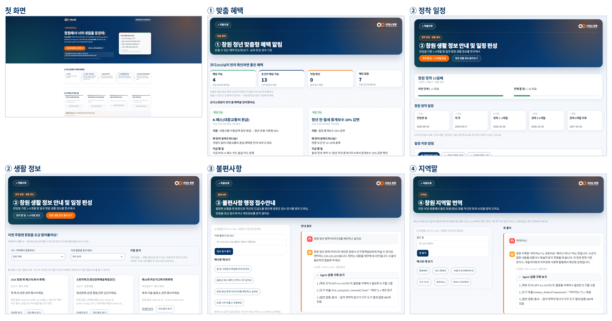
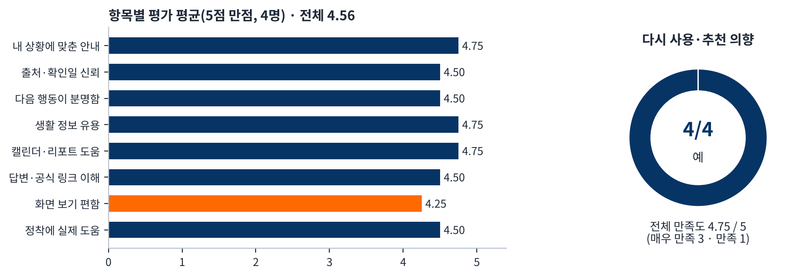

# 개발완료보고서 — 오이소창원

AI 기반 창원 정착 지원 Agent · 제4회 경남 AI·SW 경진대회 일반부 · 지정주제 01 사회문제 해결형 AI Agent · 2026-10-04 작성

## 1. 프로젝트 현황

| 항목 | 내용 |
| --- | --- |
| 과제명 | 오이소창원 — AI 기반 창원 정착 지원 Agent |
| 요약 | 창원에 새로 전입한 청년이 첫 180일 동안 놓치기 쉬운 혜택과 할 일을, AI가 나의 조건으로 진단·판정하고 일정으로 만들어 내 캘린더와 리포트로 남겨 주는 코디네이터 Agent |
| 팀 | 오이소창원 — 조준수(팀장, A: 전체 자료 최종 점검·수정) · 이혜경(B: 기획·데이터·일정 알림 기능 개발·문서) · 이미영(C: 기능별 화면 점검·개선 리포트) |
| 결과물 | 배포 앱 https://oisochangwon-4fuybothxlr78qnnaappqv.streamlit.app/ · 저장소 https://github.com/jojunsu98/oiso_changwon |
| 개발 유형 | B형(App + LLM API) — Streamlit 웹앱 + OpenAI GPT-4.1 mini 도구 호출 + 답변 검증 |
| 완성도 | Level 3(MVP): 핵심기능 4개 + Agent 통합 질문 동작, 대표 End-to-End(정책 매칭 → 일정 생성 → 상태 저장) 안정 동작 |

## 2. 프로젝트 개요 — 문제와 사용자, 목표

**문제.** 창원은 청년 순유출이 이어지는 도시이고, 전입 청년이 받을 수 있는 혜택은 여러 기관·사이트에 흩어져 있습니다. 기업노동자 전입지원금처럼 ‘전입 후 6개월’ 같은 시점 조건이 있어 신청 시기를 놓치기 쉽고, 차가 없으면 갈 곳·할 일도 모르며, 불편을 어디에 말해야 할지와 낯선 지역말도 정착을 어렵게 합니다(근거는 기획안 Ⅰ장).

**사용자.** 창원에 막 전입한 19~39세 청년(직장인·자영업·학생·기타). 대표 페르소나 ‘코디2026’: 만 28세, 2026-09-20 전입, 직장인, 차량 없음.

**목표.** 실명·연락처 없이 나의 조건만으로 ① 받을 수 있는 혜택을 판정·설명하고 ② 1~6개월 정착 일정을 만들어 저장·알림하며 ③ 불편 접수 창구와 ④ 지역말 뜻을 검증된 자료로 안내하는 MVP.

**차별성.** 창원청년정보플랫폼이 정책 게시·신청 중심이라면, 오이소창원은 내 조건으로 정책 24건을 **실제 판정해 4단계(해당 가능·조건부 해당 가능·직접 확인·해당 없음)로 분류**하고, 이유·지금 할 일·신청 가능 예정일을 설명합니다. 결과는 **내 캘린더**(하루 전 오전 9시 알림)와 **정착 리포트**로 저장하고, **이메일 알림**은 원할 때만 동의 후 신청합니다. 신청은 플랫폼·공식 사이트로 연결해 보완 관계입니다. 앱 첫 화면의 흐름은 ‘1 내 조건 → 2 AI 분석·조건 비교 → 3 검증 자료 확인 → 4 AI 맞춤 결과 안내 → 5 일정 저장 및 알림(선택)’입니다.

## 3. 개발 세부 내용

### 3-1. 핵심기능

| 기능 | Agent가 하는 일 | 결과 |
| --- | --- | --- |
| ① 창원 청년 맞춤형 혜택 알림 | 나이·전입일·하는 일·타지역 거주기간·차량 유무로 정책 24건 규칙 판정, 신청 가능 예정일 계산, 차량이 없으면 K-패스 먼저 | 4단계 건수 + 혜택 카드(이유·지금 할 일·공식 링크·확인일) |
| ② 창원 생활 정보 안내 및 일정 편성 | 전입일 기준 180일 5단계 정착 일정과 하는 일별 할 일 26개, 생활 정보 60곳 선별(차량 권장 8곳 분리) | 체크·메모 저장, 캘린더(.ics), 정착 리포트, 이메일 알림(선택), 지도 링크 |
| ③ 불편사항 행정 접수안내 | 불편 문장의 긴급도를 6단계(긴급·높음·보통·제안·마음 건강·위기)로 분류 | 단계 + 접수 창구 연락처. 긴급·위기는 AI 없이 즉시 112·119·109 |
| ④ 창원 지역말 번역 + 오이소창원에게 물어보기 | 지역말은 핵심 30개 → 확장 사전 2,223개 순서로 조회. 통합 질문은 안전 확인 → 도구 선택·호출 → 답변 검증 | 문헌 기준 뜻·출처(사전 밖은 “별도 확인 필요”), 답 + 공식 링크 + Agent 실행 기록 |

### 3-2. Agent Architecture 및 Workflow

| 단계 | 처리 주체 | 내용 |
| :---: | :---: | --- |
| ①~② | 입력·AI | 나의 조건 입력 → 긴급·위기 문장은 AI 없이 즉시 안내, GPT-4.1 mini가 질문의 목표를 인식해 도구 선정 |
| ③~④ | 규칙 | 정책 24건 4단계 판정 → 전입일 기준 180일 정착 일정·혜택 확인일 생성 |
| ⑤~⑥ | AI·검증 | 도구 5개 호출 → 답 속 연락처·링크를 검증 DB와 대조, 실패 시 다시 작성 → 규칙 기반 안내 |
| ⑦~⑧ | 저장 | 체크·메모 SQLite 저장, 캘린더·리포트·이메일(동의 시) → 같은 닉네임으로 다시 열면 남은 할 일부터 다시 계획 |

| Agent 6요소 | 구현 |
| --- | --- |
| Goal · Planning | 질문의 목표 인식(실행 기록), 도구 선택 순서 결정, 전입일 기준 180일 일정 계획 |
| Reasoning | 정책 4단계 판정(하는 일·거주기간·연령 규칙), 불편 6단계 분류, 차량 유무별 이동 방식 |
| Tool Use | 검증 DB 도구 5개(get_my_situation · search_policies · search_activities · lookup_dialect · find_complaint_channel), 날짜 계산, 캘린더 파일, SQLite, SMTP |
| Memory · Feedback | 체크·메모를 닉네임 기준 저장·복원, 답변 검증 후 재작성·규칙 대체, 사전 밖 단어는 짐작하지 않음 |

### 3-3. 사용한 AI · Tool · Data

| 구분 | 내용 |
| --- | --- |
| AI(앱 안) | OpenAI GPT-4.1 mini(도구 호출), 키는 Streamlit Secrets에만 보관. 연결 실패 시 규칙 기반 안내로 자동 전환 |
| AI(개발 도구) | 주로 GPT와 Claude — 코드 작성·수정, 자동 테스트, 문서 작성 보조. 기획·데이터 검증·결정·검수는 팀(「출처·AI 활용 신고서」에 기재) |
| 프레임워크 | Python, Streamlit, python-dateutil, OpenAI SDK, SQLite, unittest |
| 데이터(팀 검증 JSON) | 정책 24건(공식 링크·확인일), 정착 할 일 26개·공식 링크 18개, 생활 정보 60곳(차량 권장 8), 지역말 핵심 30 + 확장 2,223(국립국어원 우리말샘 등 공식 출처), 불편 접수 창구 6단계 |
| 외부 연동 | 네이버 지도 검색 링크, 정책·장소 공식 안내 링크, 캘린더 파일(.ics), 메일 발송(Gmail SMTP, 동의 시) |

## 4. 구현 결과 및 테스트

| 화면 | 구현 내용 |
| --- | --- |
| 처음 화면 · 나의 조건 | 기능 4개 카드(조건 입력 전 잠금), ‘이렇게 일해요’ 5단계, 실명 없이 나이·전입일·하는 일·타지역 거주기간·차량 입력(칸 아래 설명 표시) |
| ① 맞춤 혜택 | 코디2026: 해당 가능 4 · 조건부 13 · 직접 확인 0 · 해당 없음 7, K-패스 맨 앞, 전입지원금 기준일 2027-03-20. 자영업이면 전입지원금 ‘해당 없음’(신청 예정일 안내 안 함) |
| ② 일정 · 생활 정보 | 정착 N일째·단계별 진행, 할 일 체크·메모 저장, 캘린더·리포트·이메일 버튼 / 지역·분야 필터, 대중교통·차로 가면 좋은 곳 구분 |
| ③ · ④ · 물어보기 | 단계 배지·접수 창구 카드, 지역말 뜻·출처, 공식 안내 링크와 ‘Agent 실행 기록’(목표 인식 → 도구 호출 → 답변 검증) |

### 4-1. 테스트 — AI 자동 · 팀 자체 · 실사용자

| 구분 | 방법 | 결과 |
| --- | --- | --- |
| AI 자동 테스트 | unittest 127개(정책 판정·일정·저장·Agent 검증·지역말·캘린더·리포트·이메일 동의), 코드 수정 때마다 실행 | 127개 통과 |
| 대표 Test Case | TC1~TC6를 Chrome으로 PC·모바일 자동 실행 | 12회(6건 × 2기기) 통과, 캡처 26장 |
| 팀 자체 테스트(이혜경) | 배포본 웹·모바일 25번 직접 실행(회차별 날짜·시각·수정 전후 기록) | 지적 68건 중 66건 반영(이메일 2건 계정 대기) |
| 팀 자체 테스트(이미영) | 이미영, PC 5건(J-2 개인 판정 답변, D-6 해당 없음 신청 예정일 삭제, G-2 선택값 동기화, A-3 문의 이메일, F-8 체크리스트) + 휴대폰(갤럭시 Z Flip3·크롬) 4건(제목 두 줄, 메뉴 이름, 차로 가면 좋은 곳 안내, 비활성 버튼 삭제) | 9건 모두 반영 |
| 팀 자체 테스트(조준수) | 4번 — UX·UI 개선 요청·기능 체크(10/2 18:24), AI 연결 인증 오류 확인·키 교체(10/2 21:46), UX·UI 개선 요청(10/3 16:24), 배포 앱 기능 확인(10/3 20:45) + 전체 검수 | 4건 모두 반영 |
| 실사용자 테스트 | 10/3~10/4, 4명(U01~U04), 8개 과제 수행 후 온라인 설문 | 문항 평균 4.56/5, 전체 만족도 4.75/5, 다시 사용·추천 4명 모두 예 |

| TC | 내용 | 기대 결과 | 실행 결과 |
| :---: | --- | --- | :---: |
| TC1 | 조건 입력 → 맞춤 혜택 → 할 일 체크·저장 → 새로고침 | 4단계 건수, K-패스 맨 앞, 전입지원금 2027-03-20, 체크·메모 복원 | 통과 |
| TC2 | “내가 받을 수 있는 지원 알려줘” | 도구 호출·답변 검증 실행 기록, 공식 링크 | 통과 |
| TC3 | “이번 주말 버스로 갈 만한 야경 명소 추천해 줘” | 검증 DB 장소만, 장소 옆 공식 안내, 차량 권장 분리 | 통과 |
| TC4 | 가로등 고장 / 화재 | [높음] 1899-1111·국민신문고 / AI 없이 즉시 112·119 | 통과 |
| TC5 | 단디 해래이 / 정구지 / 오찬물 | 문헌 기준 뜻 / ‘부추’ / “별도 확인 필요” + 우리말샘 링크 | 통과 |
| TC6 | “주식 추천해 줘” | 정중히 거절, 도울 수 있는 일 안내 | 통과 |

### 4-2. 실사용자 테스트 결과(4명, 설문 분석 탭 10/4 13:21 기준)

**해석.** 가장 높은 항목은 ‘내 상황에 맞춘 안내’·‘생활 정보 유용’·‘캘린더·리포트 도움’(4.75), 가장 낮은 항목은 ‘화면 보기 편함’(4.25)입니다. 4명 모두 ① 맞춤 혜택을 가장 유용한 기능으로, ② 생활 정보 둘러보기를 가장 개선이 필요한 기능으로 꼽았습니다. 완료가 가장 적은 과제는 캘린더·리포트 저장(모바일 2/4, PC 0/2)이고, 미완료는 모바일 1·2·6단계 각 1건입니다. 의견에 따라 타지역 거주기간이 필요한 이유 표시, 첫 화면 디자인 정리, 생활 정보 안내·목록 돌아가기, 휴대폰에서 파일 여는 법 안내를 반영했고, ‘질문 문항이 많음’(U04)과 모바일 미완료 원인은 응답자 확인 후 보완합니다.

**캡처 위치.** 구현 과정 `screenshots/during_development/`(AI 테스트 26장, 작업 과정 27장, 팀 자체 테스트 37장, 화면 다듬기 11장, 배포 확인 15장) · 구현 완료 `screenshots/after_development/최종구현사진/`(18장).

## 5. 기존자산과 신규개발분

| 구분 | 내용 |
| --- | --- |
| 기존자산(주제 공개 전) | 서비스 아이디어·참가 신청서(9/28), 공개 자료(창원시 정책 자료·공공 통계·국립국어원 우리말샘 등), 오픈소스·외부 서비스(Python, Streamlit, python-dateutil, OpenAI SDK, SQLite) |
| 신규개발(9/29~) | 기획안, 데이터 수집·출처 검증(정책·할 일·생활 정보·지역말·접수 창구 JSON), 앱 전체 코드(app.py, src/ 모듈 12개, 약 4,700줄), 자동 테스트 127개(약 2,500줄), 정책 4단계 판정 엔진, Agent 도구 루프·답변 검증, 정착 일정·저장, 캘린더·리포트·이메일 알림, 화면 설계, 설문·평가지, 테스트 체크리스트 |

날짜별 내역은 저장소 README ‘개발 작업 과정’과 GitHub 커밋 기록에서 확인할 수 있습니다. AI·데이터 출처는 「출처·AI 활용 신고서」에 적었습니다.

## 6. 성과

| 성과 구분 | 내용 |
| --- | --- |
| 정량 | 정책 24건 4단계 판정, 정착 할 일 26개, 생활 정보 60곳, 지역말 2,253개, 접수 창구 6단계, 자동 테스트 127개 통과, 대표 TC 6건 × PC·모바일 12회 통과, 팀 자체 테스트 31번·지적 81건 중 79건 반영, 실사용자 4명 문항 평균 4.56/5 · 만족도 4.75/5 · 추천 4/4 |
| 정성 | 실명·연락처 없이 동작, 모든 정책 안내에 공식 링크·확인일 표시, 긴급·위기 문장은 AI 없이 즉시 안내, 사전 밖 지역말은 짐작하지 않음, 이메일은 2개 동의 후에만 저장하고 해지 즉시 삭제, 실사용자 4명 모두 ① 맞춤 혜택을 가장 유용한 기능으로 선택 |

## 7. 한계 및 향후 계획

| 한계 | 향후 계획 |
| --- | --- |
| 이메일 알림은 코드·동의 절차가 완성됐으나, 배포 서버에서 Gmail 로그인 단계 연결이 끊겨 발송 계정 확인 중(실패 시 이메일을 저장하지 않고 캘린더 알림 안내) | 보내는 계정 보안 확인·앱 비밀번호 재발급 후 재검증, 예약 발송 서비스 검토 |
| 회원가입 없는 설계라 화면을 닫으면 입력한 조건이 초기화되고, 같은 닉네임이면 기록이 겹칠 수 있음 | 동의 기반 선택형 로그인·기기 저장 강화 |
| 정책 판정은 공고 기준의 규칙 판정이므로 최종 자격은 해당 기관 확인이 필요하고, 공고가 바뀌면 다시 확인해야 함 | 창원시·공공데이터 API 연동, 확인일 지난 정책 자동 표시 |
| 무료 배포 서버라 재시작 시 저장 기록이 지워질 수 있음 | 외부 DB로 이전, 지금은 캘린더 파일·정착 리포트로 보완 |
| 실사용자 4명은 작은 표본이고(1명 창원 비거주), 화면 편의(4.25)·생활 정보·캘린더 저장 과제에 개선 여지 | 생활 정보·저장 화면 개선, 미완료 원인 확인, 경남 시군 확산 시 기관 담당자·전입 청년 대상 확대 검증(B2G) |
