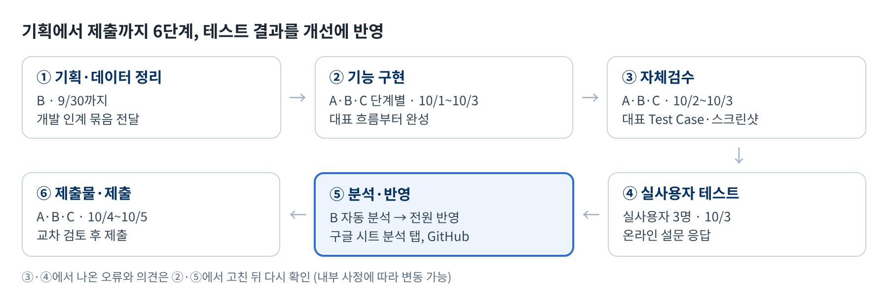
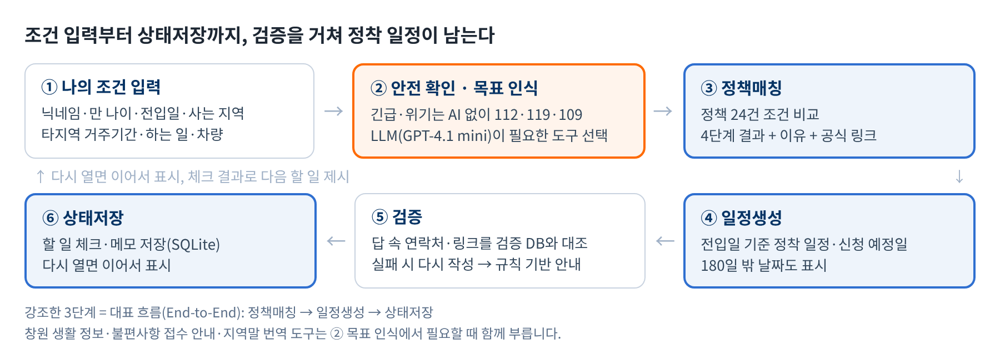

# 오이소창원 기획안

2026-10-03 갱신 · 이혜경 · 제4회 경남 AI·SW 경진대회 일반부 · 지정주제 01 사회문제 해결형 AI Agent

| 항목 | 내용 |
| --- | --- |
| 과제명 | 오이소창원 — AI 기반 창원 정착 지원 Agent |
| 한 줄 소개 | 창원에 새로 전입한 청년의 초기 정착을 돕는 코디네이터 Agent입니다. |
| 하는 일 | 받을 수 있는 혜택을 AI가 진단해 4단계로 판정하고, 언제 무엇을 해야 하는지 일정으로 만들어 캘린더·정착 리포트로 저장해 줍니다. 진행 상황을 기억해 다음 할 일을 다시 안내합니다. |
| 슬로건 | 창원에서 너의 내일을 응원해! |
| 팀 | 오이소창원(일반부) — 조준수(팀장), 이혜경, 이미영 |
| 지정주제 | 01 사회문제 해결형 AI Agent |
| 개발 유형 | B형(App + LLM API) + 답변 검증 단계 |
| 구현 방식 | Streamlit 웹앱에서 OpenAI GPT-4.1 mini가 검증 DB 도구를 골라 쓰고, 날짜 계산·진행 상태 저장과 연동 |
| 배포 | https://oisochangwon-4fuybothxlr78qnnaappqv.streamlit.app/ |
| 저장소 | https://github.com/jojunsu98/oiso_changwon |
| 앱 문의 | whwnstn9294@gmail.com |

## Ⅰ. 추진배경 및 필요성

### 1. 사회문제: 청년 유출과 지방의 인구소멸 위험

청년 유출은 지방의 인구소멸 위험을 키우는 대표적인 원인으로 꼽힙니다. 경남에서는 2025년에도 청년 1만 명 넘게, 그중 20대가 9천 명 넘게 빠져나갔습니다.

| 경남 지표 | 값 | 출처 |
| --- | --- | --- |
| 경남 청년(19~39세) 순유출 | 10,112명(2025) | 국가데이터처 2025 국내인구이동통계(스트레이트뉴스 2026.1.29) |
| 경남 20대 순유출 | 9,129명(2025) | 같은 통계(경남도민일보 2026.2.1) |

### 2. 창원의 상황

창원은 경남의 중심 도시이지만 2025년 경남 시군 중 순유출이 가장 많았습니다. 특례시 기준(100만 명)을 간신히 넘고, 해마다 5만 명 넘는 청년이 들어오지만 더 많이 떠납니다.

| 창원 지표 | 값 | 출처 |
| --- | --- | --- |
| 총인구(외국인 포함) | 1,009,003명 (2026.8) | 창원시 인구정책 브리핑 2026.9월호 |
| 청년인구 | 221,641명 (22.5%) | 같음 |
| 전입-전출 | -810명 (7월 말 대비) | 같음 |
| 창원 순유출 | 6,616명(2025, 경남 시군 중 최다) | 국가데이터처 2025 국내인구이동통계(경남도민일보 2026.2.1) |
| 청년 전입 / 전출 | 53,583명 / 59,351명 (2023) | 창원특례시의회 정책제언(2025) |
| 25~29세 순유출률 | -3.48%(2015) → -8.47%(2024) | 서울경제·경남도민일보 |
| 첫 직장에 관심 있는 청년의 이주 계획 | 57.9% (178명 중) | 경남도민일보(2026.9) |

### 3. 왜 ‘초기 180일’인가

들어온 청년이 자리 잡지 못하고 다시 떠나면 청년 유출은 멈추지 않습니다. 정착 지원 제도도 전입 초기를 기준으로 짜여 있습니다.

- **기업노동자 전입 지원금(창원시):** 전입 후 **6개월 이상 계속 거주**해야 신청 가능(직장인·자영업)
- **전입 대학(원)생 생활안정지원(창원시):** 타 시·군·구 1년 이상 거주 후 창원 전입, 관내 대학(원) 재학생 — 월 6만원, 최대 3년
- **청년일자리도약장려금(고용노동부):** 비수도권 정규직 청년에게 **근속 6·12·18·24개월 차** 근속인센티브

오이소창원은 이 신청 시점을 대신 계산해 초기 정착을 돕고, 청년 유출을 줄이는 데 보태는 것을 목표로 합니다.

> **180일 표기:** 180일은 연구로 입증된 정착 기간이 아니라, 위 제도들의 기준(전입 후 6개월)을 참고해 팀이 정한 **서비스 설계 기간**입니다. AI가 인구 문제를 직접 해결한다고 주장하지 않고, 정착 과정의 정보 부담을 줄이는 데 초점을 둡니다.

### 4. 신규 전입 청년이 겪는 문제

| 문제 | 근거 | 출처 |
| --- | --- | --- |
| 혜택이 여러 기관·사이트에 흩어져 있어 관련 정보를 모르거나 신청 시점을 놓치는 경우가 많음 | 청년 39.3%가 “관심이 있어도 맞는 정책을 찾기 어렵다”고 답함. 창원 전입지원금처럼 ‘전입 후 6개월’ 같은 시점 조건이 있음. 창원시 청년정책만 해도 2026년 5대 분야 79개 사업(475억원)이고, 국비·도비 사업은 신청 창구가 또 다름(복지로·경남바로서비스·모다드림 등) | 열고닫기 청년데이터연구소 조사(청년 281명, 아시아경제 2026.9.18), 「혜택만 콕! 2026」, 「한눈에 보는 2026 창원시 청년정책」 |
| 차 없이 낯선 도시에서 갈 곳·할 일을 모름 | 청년의 지역 이동은 일자리뿐 아니라 삶의 질·생활 인프라의 문제로 분석됨. ‘거의 집에만 있는’ 청년은 5.2%(2024)로 2022년(2.4%)의 두 배 이상이며, 창원시도 고립·은둔청년지원사업 ‘온:청’을 운영 | 청년재단 2025 지역 청년 1,000명 조사(서울신문 2026.4.3), 국무조정실 2024 청년 삶 실태조사(서울신문 2025.3.11), 창원특례시 ‘온:청’ 포스터 |
| 불편을 느껴도 어디에 말해야 하는지 모름 | 창원시청 인구정책담당관과 통화한 결과, 시민의 정책 접수는 국민신문고 사이트(본인인증)에 글을 쓰는 방법과 창원시청에 전화(담당자 연결 후)로 접수하는 방법이 있다고 함 | 9/29 창원시청 인구정책담당관 통화(팀 확인), 창원특례시 누리집 부서 업무 |
| 창원의 지역말이 낯설고 생소함 | 국민 59.2%가 “지역 방언은 유지·보존해야 한다”고 답함 → 지역말은 고칠 대상이 아니라 이해할 지역 문화. 전입 청년이 느끼는 낯섦은 실사용자 설문으로 확인 | 국립국어원 2025 국민의 언어 의식 조사(뉴스핌 2026.1.27) |

### 5. 기존 서비스와 차별성

기존 서비스는 “무엇이 있나”를 보여 주고 신청을 받습니다. 오이소창원은 AI가 내 조건으로 **받을 수 있는지 진단**하고, **언제 무엇을 해야 하는지** 일정으로 만들어 **내 캘린더와 리포트로 남겨** 줍니다.

| 기존 서비스 | 하는 일 | 오이소창원이 더하는 것 |
| --- | --- | --- |
| 창원청년정보플랫폼(창원시, 2024.1 개통) | 창원시 청년정책 게시·검색, 온라인 사업 신청·접수·결과 확인, 관심분야 문자 알림, 청년공간 대관, 마음건강진단 | ① **AI 맞춤 진단:** 나의 조건(나이·전입일·하는 일·타지역 거주기간·차량 유무)으로 정책 24건을 실제 판정해 **해당 가능 · 조건부 해당 가능 · 직접 확인 · 해당 없음** 4단계로 분류 ② **판정 설명:** 신청할 수 있는 이유 / 안 되는 이유, 지금 할 일, 신청 가능 예정일(예: 전입 후 6개월 기준일), 공식 링크·확인일 ③ **📅 캘린더 저장:** 휴대폰에서 저장하면 내 캘린더에 정착 일정·혜택 확인일이 들어가고 하루 전 알림 ④ **📄 정착 리포트 저장:** 정착 할 일과 지원 혜택 신청 가능 일자를 시간 순서로 정리하고 공식 자료 링크를 함께 제공 ⑤ **✉️ 이메일 알림(선택):** 원할 때만, 개인정보 수집·이용 동의와 수신 동의 후 일정 알림 ⑥ 공공서비스 밖의 생활 정보(노포 맛집·카페·러닝·야경·쇼핑·의료)와 지역말 번역까지. 신청은 플랫폼·공식 사이트로 연결(경쟁이 아니라 보완) |
| 온통청년·청년몽땅정보통 | 청년 정책 검색·추천 | 창원 전입일 기준 신청 가능일 계산과 1~6개월 정착 일정, 할 일 체크·저장 |
| 창원 AI당직전문관 | 야간·휴일 민원 응대 | 불편의 긴급도 판단과 맞는 창구 안내(긴급·위기는 AI 없이 즉시 112·119·109) |
| 사투리 번역기 | 표준어↔사투리 변환 | 들은 말 이해 중심, 국립국어원·경남방언사전 등 근거 표시, 사전에 없는 말은 짐작하지 않고 우리말샘 찾아보기 안내 |

## Ⅱ. 과제 목표 및 기대효과

### 1. 서비스 목표

오이소창원의 대상은 창원에 새로 전입한 청년(19~39세)입니다. 이 청년이 전입 후 180일 동안 아래 네 가지 서비스를 받도록 합니다. 수치 목표는 **MVP 구현 기간(~10/5) 안에 달성 여부를 확인할 수 있는 것**으로 정했습니다. ‘오이소창원에게 물어보기’는 네 가지 서비스를 한 문장 질문으로 넘나드는 Agent 입구입니다(별도 기능 아님).

| 서비스 | 내용 | 수치 목표(MVP 기간 확인) |
| --- | --- | --- |
| ① 창원 청년 맞춤형 혜택 알림 서비스 | 전입 청년이 자신에게 해당 가능성이 있는 정책을 확인하고, 신청 시점을 일정으로 받는다 | 정책 24건 4단계 판정(해당 가능/조건부 해당 가능/직접 확인/해당 없음), 판단 이유·공식 링크·확인일 표시 100%, 정책 판정 오류 0건, 180일 밖 날짜 “(180일 이후)” 표시 |
| ② 창원 생활 정보 안내 및 일정 편성을 통한 정착 유도 서비스 | 전입 청년이 1~6개월 정착 할 일과, 오션뷰 카페·맛집·반려동물 동반 장소·야경 명소 같은 청년 핫플레이스와 지역탐방·문화생활·쇼핑·의료 정보를 얻어 창원 생활에 익숙해진다 | 정착 할 일 26개 체크·메모 저장·복원 100%, 관심사·생활권에 맞는 곳 3곳 이상 추천, 운영시간·출처 표시 100%, 실내·실외·대중교통(차량 유무) 반영 100% |
| ③ 불편사항 행정 접수 안내 서비스 | 전입 청년이 겪은 불편·위험을 알맞은 창구에 접수하도록 안내받는다 | 테스트 문장(긴급·높음·보통·제안·마음 건강·위기)마다 알맞은 창구 안내 100%, 긴급·위기 문장은 112·119·109 즉시 안내 100% |
| ④ 창원 지역말 번역 서비스 | 전입 청년이 들은 창원 지역말의 뜻을 알고 지역민과 원활하게 소통한다 | 핵심 지역말 30개 + 공식 출처 확장 사전 2,223개 뜻 안내 100%(“문헌 기준 뜻”·출처 표시), 사전에 없는 말은 “별도 확인 필요” + 국립국어원 우리말샘 찾아보기 안내 100% |

실사용자 3명(또는 기관 담당자) 온라인 설문에서 만족도 평균 5점 중 4점 이상을 함께 목표로 합니다.

### 2. 기대효과

- **사용자:** 혜택 신청 시점을 놓치는 일을 줄이고, 여러 사이트를 검색하는 시간을 줄입니다.
- **창원시:** 이미 있는 사업(전입지원금·청년월세 등)의 활용을 높여 새 예산 없이 정착을 돕습니다.
- **사회:** 지방에 유입된 청년의 초기 정착을 도움으로써 청년 유출을 막고 지방의 인구소멸 위험에 대응합니다.
- **비즈니스 모델(B2G):** 창원시·경남 시군에 전입자 정착 도구로 제공하고 전입신고 때 안내합니다. 익명 집계 ‘전입자 정착 불편 리포트’는 시와 협의 후 도입합니다.
- **확장:** 지자체가 전입 초기에 지역화폐나 웰컴쿠폰(지역 명소 무료입장권 등)을 함께 지급한다면 청년의 초기 정착을 더 돕고 서비스 이용자도 늘어날 것으로 기대합니다. 청년 외 전입자(생애주기별 정책), 경남 타 시군으로도 데이터만 바꿔 확산할 수 있습니다.

## Ⅲ. 세부내용 및 역할 배분

### 1. 핵심기능

하나의 Agent가 사용자 상태를 기억하며 필요한 도구를 골라 씁니다. 모든 답변은 검증 단계를 거쳐 나갑니다.

| 기능 | Agent가 하는 일 | 사용자에게 남는 결과 | 데이터·도구 |
| --- | --- | --- | --- |
| ① 창원 청년 맞춤형 혜택 알림(정착 플래너 중심) | 나이·전입일·하는 일·타지역 거주기간·차량 유무로 정책 조건을 실제 판정, 신청 가능 예정일 계산(전입 후 6개월 등), 차량이 없으면 대중교통 혜택(K-패스) 먼저 | 4단계 판정(해당 가능·조건부 해당 가능·직접 확인·해당 없음)과 맞춤 혜택 카드(신청 가능한 이유 / 안 되는 이유·지금 할 일·공식 링크·확인일) | 검증 정책 DB 24건, 날짜 계산 코드 |
| ② 창원 생활 정보 안내·일정 편성 | 전입일 기준 1~6개월 정착 할 일 제시, 관심사·생활권·실내 여부·차량 유무 조건으로 카페·맛집·반려동물 동반·야경 핫플레이스와 지역탐방·문화생활·쇼핑·의료 후보 선별, 외곽(차량 권장 8곳)은 “차로 가면 좋은 곳”으로 분리 | 정착 일정·할 일 체크리스트(저장), 📅 캘린더 저장·📄 정착 리포트 저장·✉️ 이메일 알림(선택), 생활 정보 목록, 네이버 지도 검색 링크 | 정착 할 일 26 · 할 일 공식 링크 18 · 검증 지역활동 60곳 · 캘린더(.ics)·리포트(HTML) 생성 · 이메일(동의 시) |
| ③ 불편사항 행정 접수 안내(사회문제형) | 불편·위험 신고의 심각도·긴급도 판단 → 우선순위와 담당 창구 추천 | 처리 단계 + 접수 창구 연락처 | 불편 접수 창구 6단계, 판단 기준 |
| ④ 창원 지역말 번역 | 들은 말의 뜻·쓰임 설명(핵심 30개 → 확장 사전 순서), 사전에 없으면 “별도 확인 필요” | 뜻·쓰임·출처 | 문장형 핵심 30개(예: “사람이 천지삐까리네”, “가가 가가?”), 공식 출처 확장 사전 2,223개 |
| 오이소창원에게 물어보기(Agent 입구) | 한 문장 질문 → 안전 확인 → 도구 선택·호출 → 답변 검증 | 답 + 관련 공식 링크 + Agent 실행 기록 | 위 데이터 전체(도구 5개) |

### 2. 불편사항 행정 접수 안내 — 창원시에 바란다

OT의 01 주제 예시(민원 데이터를 분석해 위험·우선순위 추천)에 맞춘 흐름입니다. 상황에 맞는 단계와 창구를 안내합니다.

| 단계 | 예시 | 안내 |
| --- | --- | --- |
| 긴급 | 화재·사고·위협 | 즉시 112·119, 다른 처리 없음(AI 거치지 않음) |
| 높음 | 도로 파손, 가로등 고장 | 창원시 콜센터 1899-1111(담당자 연결 후 전화 접수), 국민신문고 |
| 보통 | 행정 절차·버스 불편 | 관련 지원 먼저 확인 → 콜센터 1899-1111, 국민신문고 |
| 제안 | 정착·청년 정책 아이디어 | 창원시 인구정책담당관 055-225-2074(시민제안 정책화) |
| 마음 건강 | 외로움·우울 | 진단하지 않고 경남 청년마음단디센터 055-286-1008 |
| 위기 | 스스로를 해치고 싶다는 표현 | AI 판단 없이 자살예방상담전화 109(24시간)·119 먼저(팀 확인 필요) |

제안서 작성, 민원 대리 제출, 개인정보 수집은 하지 않습니다. 단계 구분은 [서비스 기획 아이디어]이고, 연락처는 창원시 누리집과 9/29 창원시청 인구정책담당관 통화로 확인했습니다.

### 3. 팀원별 담당 업무 (내부 사정에 따라 변동 가능)

|  | 이름 | 주요 역할 | 세부 담당 업무 | 제출물(제안) |
| --- | --- | --- | --- | --- |
| A | 조준수(팀장) | UX·발표·품질 검증·최종 점검 | 사용자 시나리오 설계, 화면·서비스 흐름 검토, 기능 테스트·개선점 도출, 팀 운영·회의 진행, 저장소·배포 관리(Streamlit Secrets: API 키·메일 발송 계정), 시연영상 편집, **전체 자료 최종 점검 및 수정** | 발표자료 10장, 시연영상 3분(편집), 제출본 최종 점검 |
| B | 이혜경 | 기획·데이터 검증·알림 기능 개발 | **기획안 작성 및 수정**, 서비스 기획, 정책·지역정보 조사, 데이터 구축·출처 검증(정책·생활 정보·지역말 확장 사전), 개발 인계, 화면 사용성(UX) 개선 요청·검토, **일정 알림 기능 개발(📅 캘린더 저장·📄 정착 리포트 저장·✉️ 동의 기반 이메일 알림)**, 실사용자 온라인 설문(Google Apps Script)과 응답 시트 자동 분석 탭 제작 | 개발완료보고서 5쪽, 출처·AI 활용 신고서, 소스코드·저장소(C와 함께) |
| C | 이미영 | 자료 검수·테스트·화면 점검 | **자료 검수:** 정책·생활 정보·지역말 데이터의 공식 URL·조건·확인일 대조, 오류 항목 정리 **테스트:** 팀 자체 테스트(최종 체크리스트로 배포본 PC·모바일 실행, 실제 AI 답변·Agent 실행 기록 캡처, 기록표 작성), 실사용자 테스트 진행과 오류 기록, 수정 후 재확인 **화면 점검:** **기능별 화면 동작 점검과 개선 리포트 제출** **기술 문서:** AI Agent 구조·도구 목록·Agent 6요소 정리 | AI Agent 기술설명서 1쪽, 기능별 화면 개선 리포트, 소스코드·저장소(B와 함께) |
| 공동 | A·B·C | — | 기능 구현은 단계별로 전원 참여, 대표 Test Case 자체 테스트(과정 스크린샷 → 개발완료보고서에 설명), 실사용자 3명 섭외(1인당 1명, 또는 기관 담당자 피드백), AI 구독 한도가 차면 다음 사람이 이어서 구현하고 서로 피드백, 시연영상 촬영(3명 함께), 제출 전 교차 검토 | — |

### 4. 업무 진행 순서

대표 흐름을 먼저 완성하고, 자체 테스트와 실사용자 테스트에서 나온 결과를 고친 뒤 제출물을 만듭니다.

## Ⅳ. 진행일정 (내부 사정에 따라 변동 가능)

| 날짜 | 할 일 | 끝나는 기준 | 주담당 |
| --- | --- | --- | --- |
| 9/28(월) | 1차 팀 회의, 참가 신청서 접수 | 신청서 접수 | 전원 |
| 9/29(화) | 온라인 OT, 기획안 수정·데이터 수집 시작 | 데이터 수집 시작 | 전원·B |
| 9/30(수) | 기획안·데이터 정리, 개발 인계, 설문지 제작 | 인계 묶음 전달 | B |
| 10/1(목) | 기능 구현 시작, 16:00 2차 팀 회의(교육장 PB실) | 개발 범위·제출 시점 확정 | 전원 |
| 10/2(금) | 기능 구현·화면 재설계·AI 연결, 대표 Test Case 자체 테스트(스크린샷) | 자체 테스트 기록 | 전원 |
| 10/3(토·개천절) | 일정 알림 기능(캘린더·정착 리포트·이메일), ③④ 화면 개선, 테스트 3종(AI 자동 → 팀 자체 → 실사용자 3명 설문)·반영, GitHub 업로드 | 팀 자체 테스트 기록·설문 응답 확보 | 전원(알림 B, 화면 점검 C, 최종 점검 A) |
| 10/4(일)~10/5(월·대체공휴일) | 보고서·기술설명서·발표자료·시연영상(촬영 3명, 편집 A) | 제출본 완성 | 전원 |
| 10/5(월) 14:00 | 3차 대면 회의 — 제출본 교차 검토, 시연영상·보고서 확인 | 제출본 확정 | 전원 |
| 10/5(월) 저녁(제안) | 제출 — 공식 마감 10/6(화) 11:00 이전이라 전날 저녁 제출을 10/1 회의에서 결정 | 제출 완료 화면 캡처 | 회의에서 결정 |
| 10/7~8 / 10/12 / 10/14 | 서류평가 / 본선 발표 / 시상 | — | 전원 |

팀원별 상세 타임테이블은 별도 문서 「오이소창원 제출 일정 가안」에서 관리합니다.

## Ⅴ. 과제 수행방법

### 1. 타겟과 페르소나

- **서비스 전체 대상:** 창원 신규 전입자
- **MVP 타겟:** 신규 전입 청년 19~39세(보유 정책의 대부분이 청년 대상)

| 항목 | 대표 페르소나 |
| --- | --- |
| 닉네임 | 코디2026(실명은 받지 않음) |
| 기본 | 만 28세, 경기도 용인시에 살다가 창원 기업에 취업해 전입한 지 얼마 안 됨, 1인가구, 차 없음(버스·자전거) |
| 겪는 어려움 | 혜택 신청 시기를 모름, 창원 생활을 할 때 차 없이 낯선 도시에서 갈 곳·할 일을 몰라 힘들고 외로움, 불편을 어디에 말할지 모름, 창원의 지역말이 낯설고 생소함 |
| 시연 가정 | 창원 전입 완료(전입일 2026-09-20), 이전 거주지 경기도 용인시(타 지역 거주 2년 — 시연용 가상값), 창원 소재 기업 직장인, 1인가구·차량 없음 — [서비스 기획 아이디어] 시연을 위한 가정. 앱은 빈 칸으로 시작하고 ‘코디2026 예시로 둘러보기’를 누를 때만 이 값을 채움 |

### 2. 활용 도구

| 영역 | 도구 |
| --- | --- |
| AI 모델 | OpenAI GPT-4.1 mini(function calling), 팀원 개인 계정 API 키(Streamlit Secrets에만 보관). Anthropic 규격도 코드상 지원 |
| 개발 | Python, Streamlit, SQLite(진행 상태 저장), 날짜 계산(python-dateutil), unittest(자동 테스트) |
| 화면 | 반응형 웹(PC·모바일), Agent 실행 기록 패널, 입력칸 쉬운 용어 도움말(?), 로고 색 테마(남색 #063465·주황 #FE6A01) |
| 지도 | 네이버 지도 검색 링크(지도 API 아님) |
| 결과물 | 맞춤 혜택 카드, 정착 일정·할 일 체크리스트(저장), 생활 정보 추천, 접수 창구 안내, 지역말 뜻 풀이, 실행 기록 |
| 데이터 | 팀이 검증한 정책·지역활동·지역말·미션·불편 접수 창구 DB(JSON, 엑셀에서 변환) |
| 테스트·협업 | Google Forms·Apps Script·Sheets(실사용자 설문·자동 분석), GitHub 저장소, Streamlit Community Cloud(배포), 구글 공유드라이브(자료 공유), 단체 카카오톡방, 디스코드 |

### 3. 시스템 워크플로우

대표 흐름(End-to-End)은 **정책매칭 → 일정생성 → 상태저장**입니다. 사용자가 나의 조건을 입력하면 Agent가 받을 수 있는 혜택을 고르고, 신청 날짜를 계산해 일정으로 만들고, 할 일 완료 여부를 저장합니다. ‘오이소창원에게 물어보기’에서는 GPT-4.1 mini가 도구 5개(내 상황 확인·정책 찾기·장소 찾기·지역말 찾기·접수 창구 찾기) 중 필요한 것을 고르고, 답 속 연락처·링크가 검증 DB에 있는지 대조한 뒤 내보냅니다. AI 연결이나 검증에 실패하면 규칙 기반 안내로 자동 전환합니다.

### 4. 기능별 Agent 결과 예시

[AI 작성 예시 - 사람 검수 필요] 입력은 페르소나 ‘코디2026’(만 28세, 9/20 용인시에서 전입·창원 기업 직장인, 1인가구, 차 없음) 기준입니다.

| 서비스 | 사용자 입력 | Agent 결과 예시 |
| --- | --- | --- |
| ① 창원 청년 맞춤형 혜택 알림 | “내가 받을 수 있는 지원 알려줘.” | 조건이 맞는 혜택 후보와 이유를 보여 줌 → 예: 차량이 없어 K-패스(대중교통비 환급)를 먼저 안내, 기업노동자 전입지원금은 “전입 후 6개월 계속 거주 조건 — 2027년 3월 20일 (180일 이후)”로 신청 시점 안내. 창원시 사업은 창원청년정보플랫폼 청년지원 서비스로 연결. 조건이 불확실하면 “직접 확인”으로 표시 |
| ② 창원 생활 정보 안내 및 일정 편성을 통한 정착 유도 | “이번 주말 버스로 갈 만한 야경 명소 추천해 줘.” | 검증 DB 장소만 추천 → 예: 용지호수공원·3·15해양누리공원·진해루해변공원. 외곽인 저도 콰이강의다리·귀산동 해안 카페거리·진해 해안도로는 “차로 가면 좋은 곳”으로 따로 안내. “특정 업체 홍보가 아니며, 방문 전 운영시간 확인”을 함께 표시 |
| ③ 불편사항 행정 접수 안내 | “집 앞 가로등이 며칠째 꺼져 있어요.” | 단계 ‘높음’으로 분류 → 창원시 콜센터 1899-1111, 국민신문고 안내. “요즘 너무 외롭고 우울해” 같은 말은 진단하지 않고 경남 청년마음단디센터(055-286-1008) 안내 |
| ④ 창원 지역말 번역 | “‘단디 해래이’가 무슨 뜻이에요?” / “오찬물이 뭐야?” | “‘제대로, 단단히, 확실히 해라’라는 뜻이에요(문헌 기준 뜻, 직장·당부).” 사전에 없는 말은 “팀이 확인한 지역말 사전에 없는 말이에요. 별도 확인이 필요해요.” + ‘국립국어원 우리말샘에서 찾아보기’ |

### 5. 한꺼번에 보여 주기 vs 나눠서 보여 주기

혜택·일정을 한꺼번에 모두 보여 주면 처음 쓰는 사람이 부담을 느낄 수 있습니다. 그래서 맞춤 혜택은 먼저 볼 카드 5개만 보여 주고 나머지는 ‘더 보기’, 해당 없음은 ‘이유 보기’로 둡니다. 카드의 긴 내용(지원 내용·신청 방법)은 ‘자세히 보기’로 펼칩니다. 정착 일정은 이번 단계의 할 일을 먼저 보여 주고, 1~6개월 전체는 단계별로 나눠 둡니다. 180일은 서비스 설계 기간이며, 연구로 입증된 기간이 아닙니다.

### 6. Agent 6요소

| 요소 | 오이소창원 적용 |
| --- | --- |
| 목표 인식 | 한 문장 질문에서 사용자가 원하는 서비스(①~④)와 긴급·마음 건강 신호를 구분 |
| 계획 | 전입일 기준으로 1~6개월 할 일 순서와 신청 가능 예정일을 정함 |
| 도구 호출 | 내 상황 확인, 정책 DB 조회, 지역활동·지역말·접수 창구 조회 |
| 판단 | 정책 4단계 판정, 긴급도 분류, 차량 유무에 따른 이동 방식(대중교통/차량 권장) 판단, 사용자 요청 시 실내 장소로 변경 |
| 결과 생성 | 맞춤 혜택 카드·정착 일정·추천 장소·창구 안내·뜻 풀이·안내 문장, Agent 실행 기록 |
| 상태 저장 | 할 일 완료·메모 저장, 다음 접속 시 같은 닉네임으로 이어서 보여 줌 |

### 7. 프롬프트 설계 원칙

- 답변은 팀이 검증한 DB(도구 결과)에 있는 내용으로만 하고, DB에 없으면 “확인된 정보에는 없어요”라고 답하고 공식 창구를 안내합니다(지역말은 우리말샘 찾아보기 안내).
- 금액·기간·조건·연락처·링크는 DB 값을 그대로 쓰고 추측하지 않습니다.
- 답변 전 검증 단계에서 답 속 연락처·링크가 도구 결과(검증 DB)에 있는지 확인합니다.
- 지원 대상 여부는 단정하지 않고 ‘해당 가능 / 조건부 해당 가능 / 직접 확인’으로 표현합니다.
- 의학·법률 판단, 투자 등 정착과 무관한 질문, 민원 대리 제출, 제안서 작성은 하지 않습니다.
- 어려운 용어는 쉬운 말로 풀어 씁니다(예: 전입일 = 새 주소로 전입신고를 한 날).

## Ⅵ. 기능요구사항 및 제약사항

### 1. 기능요구사항

| ID | 요구사항 | 구분 |
| --- | --- | --- |
| FR-01 | 나의 조건 입력(닉네임·만 나이·전입일·사는 지역·타지역 거주기간·지금 하는 일[직장인·자영업·학생·기타]·차량 유무). 실명·연락처는 받지 않고 닉네임만 사용(예: 코디2026) | 필수 |
| FR-02 | 정책매칭: 정책 조건 비교 후 4단계 결과와 이유·공식 링크·확인일 표시. 창원시 사업은 창원청년정보플랫폼 청년지원 서비스 상세 링크로 연결 | 필수 |
| FR-03 | 일정생성: 전입일 기준 정착 일정(0·7·30·90·180일)과 신청 가능 예정일, 180일 밖 날짜는 “180일 이후” 표시 | 필수 |
| FR-04 | 상태저장: 할 일 완료·메모 저장, 다시 열면 이어서 표시 | 필수 |
| FR-05 | 답변 검증 단계와 Agent 실행 기록 표시 | 필수 |
| FR-06 | 창원 생활 정보 안내 및 일정 편성(카페·맛집·반려동물 동반·야경 핫플레이스와 지역탐방·쇼핑·문화생활·행사·의료, 실내 장소·대중교통/차량 권장 구분, 지도 검색 링크) | 필수 |
| FR-07 | 불편사항 행정 접수 안내(긴급·높음·보통·제안·마음 건강·위기 판단, 창구 안내) | 필수 |
| FR-08 | 창원 지역말 번역(실생활 문장형 핵심 30개 우선 → 공식 출처 확장 사전, “문헌 기준 뜻”·출처 표시, 사전 밖은 “별도 확인 필요”) | 필수 |
| FR-09 | 일정 알림·시각화(캘린더 파일·이메일 알림) | 내부 의논 후 결정 |
| FR-10 | 쉬운 말 도움말: 입력칸·화면의 어려운 용어 옆에 짧은 설명 표시(예: 전입일 = 새 주소로 전입신고를 한 날) | 필수 |

### 2. 제약사항

- 개발 기간 8일(9/29~10/6), 기능 구현은 단계별로 전원 참여(AI 구독 한도가 차면 다음 사람이 이어받음) → 대표 흐름을 먼저 완성하고 범위를 줄입니다.
- 정책·활동 정보는 확인일 기준이며 바뀔 수 있음 → 모든 안내에 확인일·공식 링크를 붙입니다.
- 자격을 확정하지 않고 “해당 가능성”으로만 안내하며, 신청·민원 제출은 사용자 본인이 합니다.
- 지역말은 시간 관계상 토박이 검수를 생략하고 공식 출처의 “문헌 기준 뜻”으로 안내합니다. 팀 제보 기반·검수 필요 자료는 사용하지 않습니다.
- 팀이 검증한 DB로만 안내하며, 실시간 웹 검색은 쓰지 않습니다.
- 카페·식당 같은 상업 시설은 영업 여부·운영시간이 바뀔 수 있어 “방문 전 확인”을 함께 안내하고, 특정 업체를 홍보하지 않습니다.
- 배포 서버가 재시작되면 저장한 체크 기록이 초기화될 수 있습니다(시연용 SQLite).
- 180일은 서비스 설계 기간으로 표기합니다.

### 3. MVP에서 제외하는 것

- 시민제안서 작성, 민원 대리 제출, 본인인증 대행, 심리 상담·진단
- 이사 전 생활권 비교, 다국어, 지역화폐·웰컴쿠폰 지급(확장 아이디어)
- 음성 입력, 대중교통 경로 계산(지도 검색 링크로 연결)
- 회원가입·결제·관리자 페이지, 자체 SNS
- 창원시 익명 집계 리포트 전달(시 협의 후)

## Ⅶ. 오류 처리 및 중복 방지 정리

| 단계 | 생길 수 있는 오류 | 대응 |
| --- | --- | --- |
| 입력 | 닉네임·전입일이 없거나 형식이 틀림 | 기능 버튼 잠금, “전입일을 입력해 주세요” 안내, 날짜 선택 입력, 용어 도움말 표시 |
| 입력 | 이름·주소·연락처 등 개인정보 입력 | 실명·연락처 칸을 두지 않음, “실명과 연락처는 받지 않아요” 안내 |
| 정책매칭 | 조건값이 없거나 확인 못 한 정책 | “직접 확인” 항목으로 표시하고 입력할 항목·담당 창구 안내(추측 금지) |
| 정책매칭 | 모집이 끝난 정책 | “모집 종료” 표시 + 다음 공고 확인 안내 |
| 일정생성 | 날짜가 없는 정책, 180일 밖 날짜 | “신청 기간 확인” 또는 “180일 이후”로 표시 |
| 상태저장 | 같은 요청을 두 번 실행해 중복 저장 | 닉네임 + 할 일 ID 기준으로 덮어쓰기(다시 실행해도 결과 동일) |
| LLM | 키 오류·사용 한도·연결 실패 | 실행 기록에 오류 종류·상태 코드 표시(키는 가림), 규칙 기반 안내로 자동 전환 |
| LLM | 도구를 부르지 않고 추측해 답함 | 검증 단계가 되돌려 다시 작성(1회), 실패하면 규칙 기반 안내 |
| 불편 접수 | 긴급 문장을 낮은 단계로 분류 | 애매하면 더 높은 단계로, 긴급·위기 키워드는 규칙으로 먼저 걸러 112·119·109 안내 |
| 마음 건강 | “심심해”, “외로워”, “우울해” 등 심리상담 요청 | 진단·상담하지 않고 경남 청년마음단디센터(경남 19~34세 청년·가족 대상 마음건강 상담·검사, 055-286-1008) 안내. 스스로를 해치고 싶다는 표현은 109·119 먼저 |
| 지역말 | 사전에 없는 말 | 뜻을 짐작하지 않고 “별도 확인 필요” + 국립국어원 우리말샘 찾아보기 링크 |
| 데이터 | JSON 파일 오류·필드 누락·링크 형식 오류 | 시작할 때 파일 검사, 문제 항목은 제외 |
| 설문 | 같은 참여자가 여러 번 응답 | 참여자 코드(U01~U03)로 1회만 집계, 중복은 분석 탭에서 표시 |

## Ⅷ. 결과 도출 방법 및 평가 기준

### 1. 최종 제출물

| 제출물 | 내용 | 담당(제안) |
| --- | --- | --- |
| 개발완료보고서 | A4 5쪽 이내, 테스트 3종 결과와 스크린샷 설명 포함 | B(+C 기술 부분) |
| 기능별 화면 개선 리포트 | 팀 자체 테스트 결과와 화면별 개선 사항 | C |
| AI Agent 기술설명서 | 1쪽 | C |
| 소스코드·저장소 | GitHub 저장소, README·실행 방법(비밀키 제외) | B·C |
| 시연영상 | 3분 이내, 실제 작동(입력 → Agent 판단 → 도구 호출 → 결과, 실행 기록) 포함 | 촬영 A·B·C, 편집 A |
| 발표자료 | 10장 이내 | A |
| 출처·AI 활용 신고서 | 기존자산·신규개발분 구분 | B |
| 제출본 최종 점검 | 전체 자료 교차 확인·수정, 키·개인정보 점검 | A |

### 2. 대회 평가 기준과 대응

| 평가 항목 | 배점 | 우리 팀 대응 |
| --- | --- | --- |
| 문제정의 | 15 | 청년 유출·지방의 인구소멸 위험 근거, 창원 통계, 페르소나 |
| Agent 구현성 | 20 | 6요소 구현, LLM 도구 선택·호출, 답변 검증, 실행 기록 |
| 기술·완성도 | 20 | 대표 흐름(조건 입력 → 혜택 → 일정 → 저장·복원), 오류 시 규칙 기반 전환, 자동 테스트 |
| 창의성 | 10 | “언제 무엇을” 계획하는 정착 플래너, 생활 정보·지역말까지 한곳에 |
| 실용성 | 15 | 실제 제도·날짜 기반 일정, 차량 유무에 따른 안내, 실사용자 테스트 |
| 데이터·안전·윤리 | 10 | 공식 출처·확인일, 검증 단계, 개인정보 미수집, 긴급·위기 즉시 안내, 마음 건강 요청은 전문기관 연결 |
| 비즈니스모델 | 10 | B2G, 경남 시군 확산 |
| 가점 | +1 | 실사용자 3명 또는 기관 담당자 피드백 증빙 |

### 3. 대표 Test Case(5건 이상) — A·B·C 자체 테스트

| 번호 | 유형 | 입력 예시 | 기대 결과 |
| --- | --- | --- | --- |
| TC1 | 정상 입력(End-to-End) | ‘코디2026 예시로 둘러보기’ → 맞춤 혜택 → 정착 일정 할 일 체크·메모 저장 → 새로고침 | 4단계 건수, K-패스 맨 앞, 기업노동자 전입지원금 “2027년 3월 20일 (180일 이후)”, 체크·메모 복원 |
| TC2 | Agent 도구 호출 | “내가 받을 수 있는 지원 알려줘” | 실행 기록에 목표 인식 → 도구 호출 → 답변 검증, 관련 공식 링크 버튼 |
| TC3 | 추천·차량 유무 | “이번 주말 버스로 갈 만한 야경 명소 추천해 줘” → 생활 정보 화면 | 검증 DB 장소만 추천, 외곽은 “차로 가면 좋은 곳”으로 분리, 대중교통 안내·지도 링크 |
| TC4 | 분류·긴급 | “집 앞 가로등이 며칠째 꺼져 있어요” / “집에 불이 났어요” | 가로등 → [높음] 1899-1111·국민신문고, 화재 → AI 없이 즉시 112·119 |
| TC5 | 데이터 없음(지역말) | ‘단디 해래이’ / “정구지” / “오찬물” | 핵심·확장 사전 뜻은 “문헌 기준 뜻”, 사전 밖은 “별도 확인 필요” + 우리말샘 링크, 추측 없음 |
| TC6 | 범위 밖 질문 | “주식 추천해 줘” | 정중히 거절하고 도와드릴 수 있는 일 안내, 지어낸 답 없음 |

A·B·C가 위 순서로 실행하고 입력·기대 결과·실제 결과·수정 내역을 기록하며, 과정을 스크린샷으로 남겨 개발완료보고서에 설명합니다. 절차와 기록표는 `tests/team_self_test/자체테스트_TestCase.md`에 있습니다.

### 4. 검증 절차 — 테스트 3종

테스트는 **AI 자동 테스트 · 팀 자체 테스트 · 실사용자 테스트** 세 가지로 구분합니다. 저장소에서도 `tests/ai_test`, `tests/team_self_test`, `tests/user_test`(캡처는 `screenshots/` 같은 이름)로 나눠 둡니다.

| 구분 | 누가 | 방법 | 결과 정리 |
| --- | --- | --- | --- |
| ① AI 자동 테스트 | AI(Claude)가 작성·실행 | unittest 115개(정책 판정·일정·저장·Agent 검증·지역말·캘린더·리포트·이메일 동의 등)를 코드 수정 때마다 실행, 대표 Test Case 6건 PC·모바일 자동 실행 캡처 | 전부 통과해야 업로드, 캡처 26장 |
| ② 팀 자체 테스트(10/3) | A·B·C(진행·기록 C) | 최종 자체 테스트 체크리스트(A~M)로 배포본을 PC·휴대폰에서 직접 실행, 실제 AI 답변·Agent 실행 기록 확인 | 기록표 + 캡처, C가 기능별 화면 개선 리포트 제출 → 수정 |
| ③ 실사용자 테스트(10/3) | 실사용자 3명(또는 기관 담당자) | 서비스를 써 보고 온라인 설문(과제 8단계·5점 평가 8문항·알림 방식)에 응답 | B가 Google Apps Script로 만든 설문 → 구글 시트 분석 탭에 평균 점수·기기별 완료 현황·만족도 차트·의견 모음 자동 정리 |

- **반영:** 개선 목록을 단계별로 전원이 반영하고, 수정 전후를 기록합니다(보고서·가점 증빙).
- **지역말:** 토박이 검수는 생략하고 공식 출처의 “문헌 기준 뜻”으로 안내합니다.
- **제출 전 점검:** 아래 체크리스트로 교차 확인하고, A가 전체 자료를 최종 점검·수정합니다.

**완료 기준:** Level 3 MVP(핵심기능 중 주요 기능과 End-to-End 1개가 실제 동작), 대표 흐름 3회 연속 정상 실행, 대표 Test Case 자체 테스트·스크린샷 기록, 실사용자 3명(또는 기관 담당자) 피드백 확보, 정책 안내의 공식 출처·확인일 100% 표시, 치명적 오류 0건.

### 5. 최종제출 체크리스트(OT 기준 16개)

| 번호 | 항목 | 우리 팀 준비 | 담당(제안) |
| --- | --- | --- | --- |
| 01 | 개발완료보고서(A4 5쪽 이내) | 이 기획안·데이터·자체 테스트 스크린샷을 바탕으로 작성 | B(+C) |
| 02 | AI Agent 기술설명서 1쪽 | 구조·Tool 목록·6요소 | C |
| 03 | 소스코드 또는 저장소 접근정보 | GitHub, README, 비밀키 제외(Streamlit Secrets) | B·C |
| 04 | 시연영상 3분 이내, 실제 작동 포함 | 대표 흐름 실제 화면 + Agent 실행 기록 | 촬영 A·B·C, 편집 A |
| 05 | 발표자료 10장 이내 | 문제·페르소나·흐름·데이터·검증·BM | A |
| 06 | 핵심기능 3~5개 중 주요 기능 실제 동작 | 기능 4개(혜택 알림 우선) | 전원(단계별) |
| 07 | 최소 1개 End-to-End Workflow 실제 시연 | 정책매칭 → 일정생성 → 상태저장 | 전원(단계별) |
| 08 | AI/LLM이 판단·추론·분류·추천·계획 역할 | 질문 이해·도구 선택·분류·추천·설명(GPT-4.1 mini) | 전원(단계별) |
| 09 | Tool/API/Data/파일 중 1개 이상 연동 | 검증 DB(JSON) 도구 5개 + 날짜 계산 + SQLite 저장 + OpenAI API | 전원(단계별) |
| 10 | 대표 Test Case 5건 이상 수행 | TC1~TC6 + 테스트 3종(AI 자동 115개 · 팀 자체 체크리스트 · 실사용자 설문) | A·B·C |
| 11 | 기존자산과 대회 기간 신규개발분 구분 | 아래 「6. 대회 기간 신규 작업 내용」, 개발 변경 기록(팀 보관)·GitHub 커밋 기록 | B |
| 12 | 생성형 AI·오픈소스·데이터·API 출처 신고 | 항목설명·출처 파일 기준 | B |
| 13 | API 키·비밀번호·개인정보·기업비밀 미노출 | Streamlit Secrets, 가상 페르소나, 제출 전 저장소·영상 검색 | C·A |
| 14 | 저작권·특허·상표·데이터 이용조건 준수 | 우리말샘 CC BY-SA 표기, 공공데이터 이용조건, 닉네임 상표 회피(코디2026), 사진·음원 확인 | 전원 |
| 15 | 시연영상·성능수치·사용자검증 자료에 허위·조작 없음 | 실제 기록만 사용, 결과가 없으면 “목표”로 표기 | 전원 |
| 16 | 피지컬 AI 안전조치 | 해당 없음(웹 서비스) | — |

OT 마지막 메시지: ‘100% 완성’은 상용제품 수준이 아니라 대회가 요구하는 MVP 기준을 채웠다는 뜻입니다. 기능을 늘리기보다 한 문제를 처음부터 끝까지 해결합니다.

### 6. 대회 기간 신규 작업 내용(기존자산과 구분)

| 구분 | 내용 |
| --- | --- |
| 기존자산(대회 전) | 서비스 아이디어·참가 신청서(9/28), 공개 자료(국립국어원 우리말샘·창원시 공개 정책 자료·공공 통계), 오픈소스·외부 서비스(Streamlit, OpenAI API·Python SDK, python-dateutil) |
| 9/29~9/30 | 기획안 작성·수정, 정책·지역활동·지역말·정착 할 일·불편 접수 창구 데이터 수집과 출처 검증(엑셀 → JSON), 개발 인계 묶음 |
| 10/1 | 기본 흐름 구현: 조건 입력 → 기업노동자 전입지원금 판정 → 전입일 기준 정착 일정 → 1~6개월 할 일 26개 체크·저장(SQLite) → 지역 활동 둘러보기, 네이버 지도 링크 |
| 10/2 | 기능별 화면 4개 분리(기획서 ①~④ 명칭 통일), 정책 24건 4단계 판정, LLM Agent(‘오이소창원에게 물어보기’: 안전 확인·도구 5개·답변 검증·실행 기록·규칙 대체), 차량 유무·하는 일 4종 반영, 차량 권장 장소 분리, 지역말 확장 사전 2,223개, 로고·색 테마와 처음 화면·조건 입력·맞춤 혜택 화면 재설계, 자동 테스트 101개, 대표 Test Case 6건 자체 테스트 |
| 10/3 | 기업노동자 전입지원금 자영업 해당 없음 수정, 하는 일별 할 일 문구, 추천 장소 옆 공식 안내 링크, ② 정착 일정·생활 정보 화면 개선, 일정 알림 기능(📅 캘린더 .ics · 📄 정착 리포트 · ✉️ 동의 기반 이메일 알림), ③ 불편사항·④ 지역말 화면 개선, 용어 ‘오이소창원(코디네이터 Agent)’ 통일, 실사용자 설문 문항 갱신, 최종 자체 테스트 체크리스트, 시연영상 스크립트, 자동 테스트 115개 |
| 10/4~10/5(예정) | 팀 자체·실사용자 테스트 반영, 개발완료보고서·기술설명서·발표자료·시연영상 |

날짜별 상세 변경 내역은 팀이 보관하는 개발 변경 기록과 GitHub 커밋 기록으로 확인합니다.

## Ⅸ. 기타

### 1. 운영 원칙

- 공식 출처를 먼저 확인하고, 추측하지 않으며 찾지 못한 값은 연락처·공식 링크·지도 검색 링크 등 바로 행동할 수 있는 안내로 바꿔 둡니다. 창원시 누리집·인구정책·청년정보플랫폼 원문은 팀이 직접 열람해 업로드한 자료로 대조합니다.
- AI가 쓴 예시는 “[AI 작성 예시 - 사람 검수 필요]”, 팀 아이디어는 “[서비스 기획 아이디어]”로 표시합니다.
- 기능 수보다 대표 흐름의 안정을 우선하고, 10/3 이후에는 새 기능을 더하지 않습니다.
- 자기 시간 안에 끝내기 어려운 일은 미리 단톡에 알리고 시간이 되는 사람에게 넘깁니다.
- 데이터는 엑셀에서 고치고 JSON은 다시 만듭니다. 발표·보고서 숫자는 최신 기준 파일을 따릅니다.

### 2. 보안 유의사항

- API 키·비밀번호는 Streamlit Secrets(로컬은 환경변수)에만 두고 GitHub·단톡·문서에 올리지 않습니다.
- 테스트 참여자는 실명 대신 코드(U01~U03)로 기록하고, 동의를 받고, 불필요한 연락처·주소는 받지 않습니다.
- 시연과 영상은 가상 페르소나로 만들고, 화면에 개인정보·키가 보이지 않게 확인합니다.
- 외로움·우울 같은 마음 건강 요청은 진단하지 않고 경남 청년마음단디센터(055-286-1008)를 안내합니다.
- 개인정보는 받지 않는 것이 원칙입니다. 이메일 알림은 사용자가 신청할 때만 개인정보 수집·이용 동의와 수신 동의를 받은 뒤 이메일 주소만 저장하고, 해지하거나 마지막 알림을 보내면 즉시 삭제합니다. 메일 발송 계정은 Streamlit Secrets에만 둡니다.

### 3. 소통 창구

| 창구 | 내용 |
| --- | --- |
| 팀 회의 | 9/28(월) 1차 회의 — 참여인원 확정, 주제 선정, 신청서 작성 및 제출서류 취합 |
| 팀 회의 | 10/1(목) 16:00 2차 회의 — 페르소나·구현 범위·협업 방식 결정(아래 4. 참고) |
| 팀 회의 | 10/5(월) 14:00 3차 대면 회의 — 제출본 교차 검토, 시연영상·보고서·발표자료 확인 |
| 단체 카카오톡방 | 작업 과정 및 중간 소통(진행 공유, 개인 구독 AI 한도 초과 시 다른 팀원에게 업무 연계하기) |
| 디스코드 | 교육장 PB실 대여 신청, 화면 공유 회의 |
| GitHub | 소스코드·데이터 버전 관리(jojunsu98/oiso_changwon), Streamlit Cloud 자동 배포 |
| 구글 공유드라이브 | 기획안·데이터·작업 파일 최신본 공유. AI 구독 한도가 차면 다음 사람이 여기서 이어받아 구현하고 서로 피드백(10/1 결정) |

### 4. 회의·개발 중 결정사항

- **페르소나(10/1):** 경기도 용인시에 살다가 창원에 취업해 전입한 지 얼마 안 된 청년(만 28세, 1인가구). 실명은 쓰지 않고 닉네임 사용 → 상표 문제로 닉네임 ‘코디세이’를 **‘코디2026’**으로 변경(10/2)
- **일정 알림·시각화(10/1):** 개인정보는 수집하지 않음. 이메일·캘린더 알림 방식은 **내부 의논 후 결정**
- **협업 방식(10/1):** 구글 공유드라이브에 자료 업로드. AI 구독 서비스 한도가 차면 다음 사람이 최신 파일을 이어받아 구현하고 서로 피드백
- **실사용자 3명(10/1):** 1인당 1명씩 섭외
- **개인정보(10/2):** ‘내 정보’ 대신 ‘나의 조건 입력’(조건만, 실명·연락처 미수집)
- **기능 구성(10/2):** 기획서 기능 4개 + ‘오이소창원에게 물어보기’(Agent 입구). 버튼에는 순번 없이 이름만
- **AI 모델(10/2):** OpenAI GPT-4.1 mini(팀원 개인 계정 키)
- **지역말(10/2):** 실시간 웹 검색 대신 공식 출처 자료만 확장, 사전 밖 단어는 “별도 확인 필요”
- **알림(10/3):** 📅 캘린더 저장·📄 정착 리포트 저장을 기본으로, ✉️ 이메일 알림은 선택(요청 시 개인정보·수신 동의 후 발송)
- **용어(10/3):** ‘AI 코디’ 대신 ‘오이소창원(코디네이터 Agent)’으로 통일, 메뉴 이름 ‘오이소창원에게 물어보기’
- **역할(10/3):** 일정 알림 기능 개발 B, 기능별 화면 동작 점검과 개선 리포트 제출 C, 전체 자료 최종 점검 및 수정 A
- **테스트(10/3):** AI 자동 테스트 · 팀 자체 테스트 · 실사용자 테스트로 구분
- **다음 회의:** 3차 대면 회의 10/5(월) 14:00 / **작업 과정·중간 소통:** 단체 카카오톡방

### 5. 초안(10/1) 대비 변경 사항

| 구분 | 초안(10/1) | 변경(10/2~10/3) | 이유 |
| --- | --- | --- | --- |
| 페르소나 닉네임 | 코디세이 | 코디2026 | 상표·저작권 비침해 |
| 개인정보 | 프로필 입력 | 나의 조건 입력(조건만, 실명·연락처 미수집) | 대회 규정(개인정보 수집 금지) |
| 하는 일 | 취업 상태(재직 여부) | 직장인·자영업·학생·기타 | 학생·자영업 대상 지원 판정 |
| AI 모델 | GPT-4·Claude·Gemini 중 선택 | OpenAI GPT-4.1 mini | 실제 배포 연결 |
| 개발 도구 | FastAPI·LangChain(필요 시) | Streamlit + 직접 구현한 도구 호출 루프 | 개발 기간·배포 편의 |
| 기능 구성 | 기능 4개 | 기능 4개 + ‘오이소창원에게 물어보기’(Agent 입구) | 핵심기능 3~5개 규정 |
| 정책 | MVP 선별 | 24건 4단계 판정(전입 대학(원)생 생활안정지원 포함) | 학생 전입자 지원 |
| 생활 정보 | 지역활동 DB | 60곳 + 차량 권장 8곳 분리, 네이버 지도 검색 링크 | 차 없는 전입자 기준 |
| 지역말 | 핵심 30 + 사전 밖 “AI 추정” 표시 | 핵심 30 + 공식 출처 확장 2,223, 사전 밖은 “별도 확인 필요” + 우리말샘 링크 | 검증되지 않은 뜻 생성 방지 |
| 알림 | 180일 여정 리포트·캘린더 파일(.ics)·요청 시 이메일 | 📅 캘린더 저장·📄 정착 리포트 저장, ✉️ 이메일 알림(선택, 개인정보·수신 동의 후) | 개인정보는 원할 때만 동의 후 수집 |
| 역할 | 일정 알림 개발·화면 점검 C | 일정 알림 개발 B, 화면 점검·개선 리포트 C, 전체 자료 최종 점검 A | 10/3 내부 조정 |
| 테스트 | 대표 Test Case 자체 테스트 + 실사용자 | AI 자동 테스트 · 팀 자체 테스트 · 실사용자 테스트 3종 | 검증 주체·방법 구분 |
| Test Case | 5건 계획 | 6건(범위 밖 질문 추가) | 안전·범위 관리 확인 |
| 화면 | 모바일 웹 | 처음 화면·조건 입력·기능별 화면·사이드바 진행 현황(PC·모바일 반응형) | UX 재설계 |

## 출처

- 제4회 경남 AI·SW 경진대회 참가 신청서(팀 오이소창원, 2026.9.28), 운영규정(v1.0), AI Agent 8일 완성 교육자료·사업설명회 자료(2026.9.29)
- 스트레이트뉴스, 경남 인구 순유출 7년 만에 최저(2026.1.29) / 경남도민일보, 경남 인구 순유출 3년 연속 감소(2026.2.1) — 국가데이터처 2025 국내인구이동통계
- 창원시 인구정책 브리핑 2026.9월호, 「혜택만 콕! 2026」 — 창원시 인구정책 / 창원특례시 「한눈에 보는 2026 창원시 청년정책」(팀 제공 PDF, 10/1 확인)
- 뉴스핌, 창원시 전입 기업노동자·대학생 지원(2026.9.21) / 창원시 인구정책 누리집(전입 대학(원)생 생활안정지원)
- 고용노동부, ’26년 청년일자리도약장려금 / 국민취업지원제도
- 서울경제, 인구 100만도 위태롭다…청년 떠나는 창원(2026.9.20) / 경남도민일보, 창원 청년에게 '경력 사다리'가 없다(2026.9)
- 창원특례시의회, 창원시 새내기 지원금과 RISE 사업 정책 제언(2025)
- 아시아경제, 열고닫기 청년데이터연구소 청년 정책 인식 조사(2026.9.18)
- 서울신문, 청년재단 2025 지역 청년 1,000명 조사(2026.4.3) / 서울신문, 2024 청년 삶 실태조사(2025.3.11)
- 뉴스핌, 국립국어원 2025 국민의 언어 의식 조사(2026.1.27)
- 창원특례시 고립·은둔청년지원사업 ‘온:청’ 포스터(마산종합사회복지관)
- 정책브리핑, 온통청년 AI 상담
- 국립국어원 우리말샘(CC BY-SA 2.0)·지역어 듣기·언어 다양성 조사, 경남방언사전(2017), 디지털창원문화대전
- 9/29 창원시청 인구정책담당관 통화(팀 확인): 시민의 정책 접수는 국민신문고(본인인증) 글쓰기 또는 창원시청 전화(담당자 연결 후)
- 창원청년정보플랫폼(2024.1.2 개통) — 확인일 2026.10.1
- 청년마음단디 경남청년마음건강센터, 경상남도 청년정보플랫폼 청년 마음건강센터 운영 — 확인일 2026.10.1
